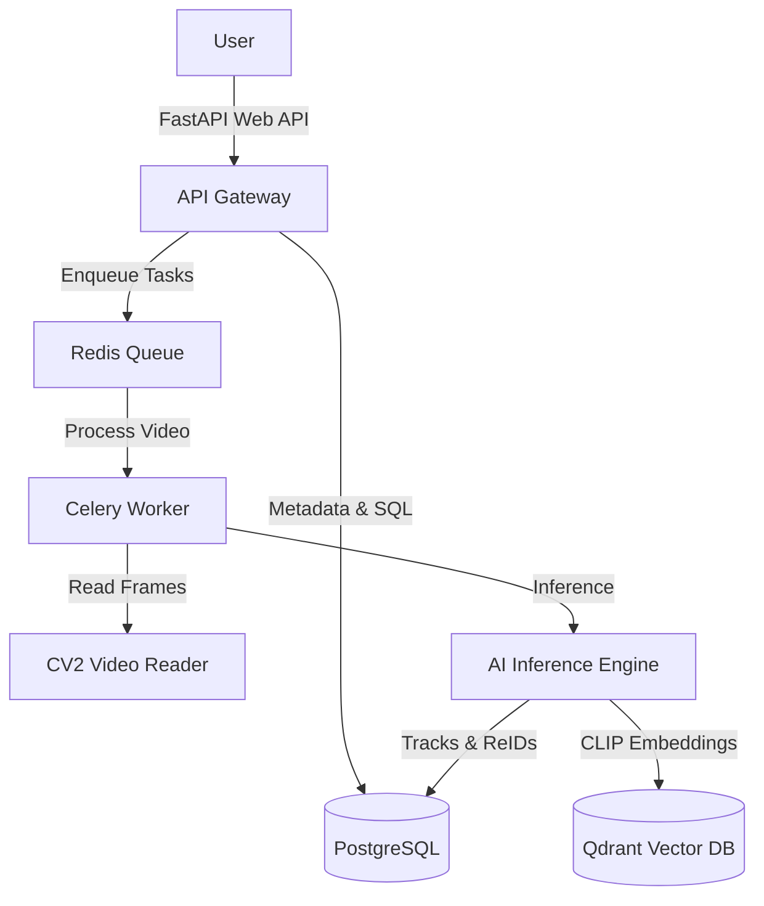
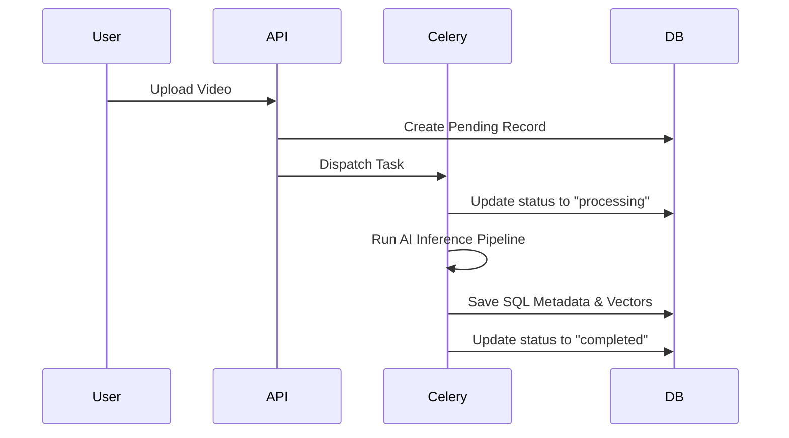
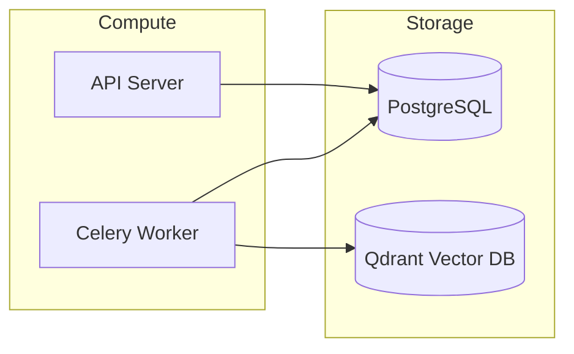

# 00_Project_Overview

## Purpose
The **AI-Powered Smart Campus Surveillance & Investigation System** exists to provide campus security personnel with a search-oriented video analysis platform. Instead of scrubbing manually through hours of CCTV footage from various campus cameras, the system processes ingested video to identify, track, and index subjects (people, vehicles, and bags) so that operators can retrieve events using natural language text descriptions (e.g., *"a person carrying a blue backpack after 1 PM"*).

## Problem Solved
Scrubbing video manually is slow, error-prone, and resource-heavy. Additionally, traditional camera systems suffer from discontinuity when moving targets transition through blind spots, and standard databases lack vector indexing capabilities to understand raw visual semantics. This system automates object tracking, extracts visual signatures (Re-ID), and indexes semantic text-image descriptors (CLIP) in a vector store to make visual events fully searchable.

## Dependencies
None. This is the root project conceptual document.

## Architecture
The system integrates an API gateway, an asynchronous task queue, deep learning frame analyzers (YOLOv8, ByteTrack, OSNet, CLIP), and dual-storage persistence (PostgreSQL and Qdrant).

## Folder Structure
- `docs/`: System documentation folder.
- `backend/`: Fast API application and workers source.
- `docker-compose.yml`: Multi-container service configuration.

## Database Changes
- `users`: Tracks authorized operators.
- `videos`: Tracks video status.
- `tracks`: Tracks trajectories.
- `detections`: Tracks frame-level bounding boxes.
- `person_reids`: Tracks human appearance vectors.

## APIs
- `GET /api/v1/health`: Checks system state.
- `POST /api/v1/auth/signup`: Registers users.
- `POST /api/v1/auth/login`: Issue JWT keys.
- `POST /api/v1/videos/upload`: Ingest video.
- `GET /api/v1/videos/{video_id}/status`: Track processing.

## Processing Pipeline
1. **Upload**: Operator posts video.
2. **Metadata**: Backend parses duration and codec.
3. **Queue**: Redis brokers tasks to Celery.
4. **AI Inference**: Runs detection, tracking, crop extraction, Re-ID, and CLIP encoding.
5. **Storage**: Commits results to PostgreSQL and Qdrant.

## AI Models Used
- **YOLOv8**: Object detection.
- **ByteTrack**: Spatial-temporal tracking.
- **OSNet**: Person re-identification.
- **CLIP**: Semantic image/text embeddings.

## Data Flow
- Raw Video -> Frame Extraction -> Crop Generation -> Feature Embeddings -> Database Indexes.

## Configuration
- `STORAGE_DIR`: Assets destination.
- `target_fps`: Downsampling rate (5.0 FPS).

## Performance Optimizations
- **Frame Skipping**: Skip intermediate frames using `cap.grab()`.
- **Batch Embedding Inference**: Runs embeddings in batches of 64 crops.

## Error Handling
- Updates database states to `failed` and records traceback parameters.

## Logging
- Logging levels set dynamically via `LOG_LEVEL` environment variable.

## Testing
- Execute python test scripts or post mock files using curl.

## Known Limitations
- No support for real-time WebSocket alerts or face recognition modules in the current baseline.

## Future Improvements
- Dedicated model inference servers (Triton) and student profile lookup tables.

## Integration Notes
- Future modules (e.g. Student Recognition) must query relational Postgres rows and match ArcFace embeddings.

## Important Classes
- `VideoProcessingOrchestrator`: Coordinates the stages.
- `FrameProcessor`: Core frame analysis loop.

## Important Functions
- `process_video`: Background task runner.

## Sequence Diagram

## Mermaid Diagram

## Summary
The **AI-Powered Smart Campus Surveillance & Investigation System** combines deep learning and dual-database indexing to allow text-to-video search of campus CCTV feeds.
