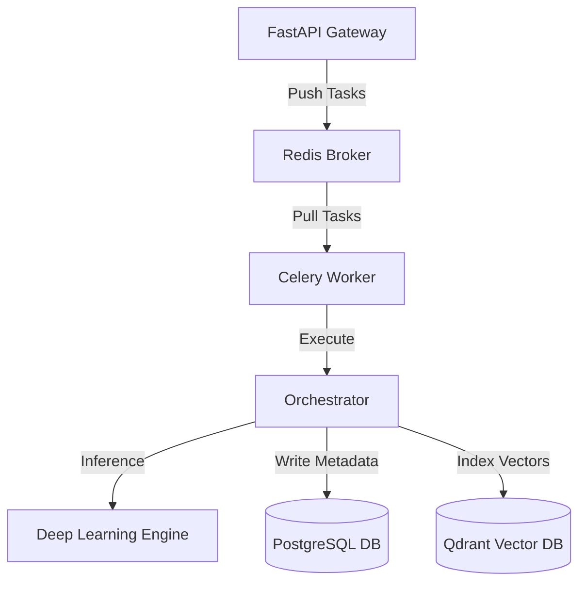
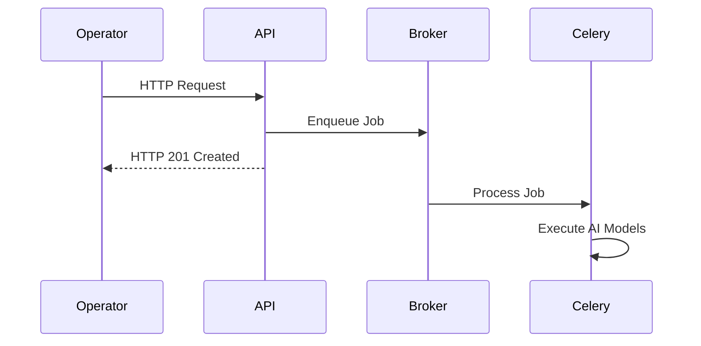
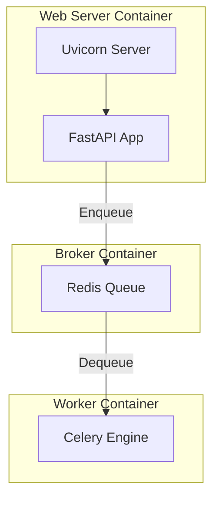

# 01_Backend_Architecture

## Purpose
The backend architecture serves to decouple operator interactions (API layer) from processing intensive operations (AI pipelines). This ensures that FastAPI remains responsive under heavy concurrent usage, while the Celery worker handles long-running video decoding and deep learning workloads.

## Problem Solved
Running deep learning models (YOLOv8, OSNet, CLIP) directly inside standard HTTP request threads blocks the server event loop, causing requests to time out. The architecture delegates tasks asynchronously via Redis message broker, maintaining UI responsiveness while executing background workloads.

## Dependencies
Requires the FastAPI framework, Celery task manager, Redis broker, PostgreSQL relational database, and Qdrant vector database.

## Architecture
The backend is structured into four main layers: API, Tasks, Pipelines, and Storage.

## Folder Structure
- `backend/app/main.py`: FastAPI entrypoint.
- `backend/app/api/`: Endpoint routers.
- `backend/app/tasks/`: Background worker logic.
- `backend/app/pipeline/`: Deep learning wrappers.
- `backend/app/core/`: Settings and security.

## Database Changes
- No structural model changes. Relies on `users`, `videos`, `tracks`, `detections`, and `person_reids` tables.

## APIs
- The system is exposed on port 8000. All routes are prefixed with `/api/v1`.
- Authentication is enforced via JWT tokens.

## Processing Pipeline
1. Ingestion: FastAPI accepts the multipart upload.
2. Metadata Extraction: Synchronously reads file properties using OpenCV.
3. Database Setup: Creates a PostgreSQL entry with a status of `queued`.
4. Asynchronous Delegation: dispatches task to Redis.
5. De-queuing: Celery worker processes the video file.
6. Execution: The frame reader downsamples and passes images to detectors.
7. Indexing: Writes coordinates to PostgreSQL and vector signatures to Qdrant.

## AI Models Used
- YOLOv8 for spatial detection.
- ByteTrack for sequential tracking.
- OSNet for human representation.
- CLIP for text-to-image semantic representation.

## Data Flow
- User Video Upload -> Disk Storage -> Async Task Dispatch -> Celery Worker Frame Loop -> Relational Data (SQL) + Semantic Vector Embeddings (Qdrant).

## Configuration
- `settings.SQLALCHEMY_DATABASE_URI`: Async Postgres connector string.
- `settings.CELERY_BROKER_URL`: Redis task queue server.
- `settings.QDRANT_HOST` / `settings.QDRANT_PORT`: Vector database locations.

## Performance Optimizations
- **Asynchronous DB Connections**: Uses SQLAlchemy AsyncSession to prevent blocked DB queries.
- **Task Queue Prefetching**: Worker prefetch multiplier is set to 1 to prevent a single worker from blocking other workers.

## Error Handling
- DB connection errors trigger `HTTP_503_SERVICE_UNAVAILABLE`.
- Background worker errors catch exceptions, write details to the `error_message` DB field, and mark status as `failed`.

## Logging
- Logging configured dynamically. Logs pipeline events and errors to console streams.

## Testing
- Verify via FastAPI docs interface (`/docs`) or run automated test suites.

## Known Limitations
- Background task states are stored locally. Lacks horizontal queue orchestration.

## Future Improvements
- Implement distributed Celery task worker scaling across Kubernetes clusters.

## Integration Notes
- Future sub-layers (e.g. Alerting) should bind to Redis PubSub or listen for SQL state updates.

## Important Classes
- `Settings`: Manages application settings.
- `FastAPI`: Gateway engine.

## Important Functions
- `setup_exception_handlers`: Configures error response structures.

## Sequence Diagram

## Mermaid Diagram

## Summary
The backend architecture implements an asynchronous, distributed model queue using FastAPI and Celery to separate HTTP operations from hardware-intensive video processing.
