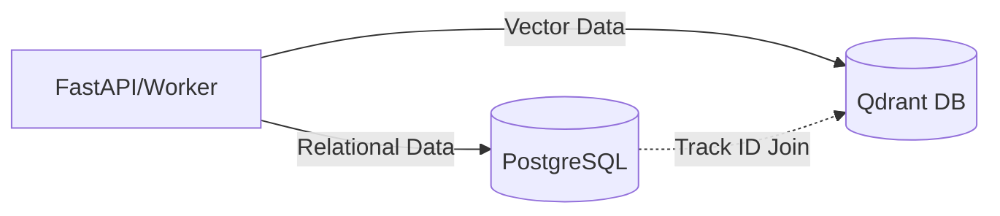
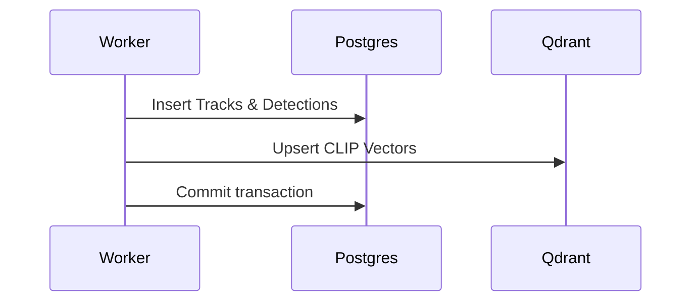
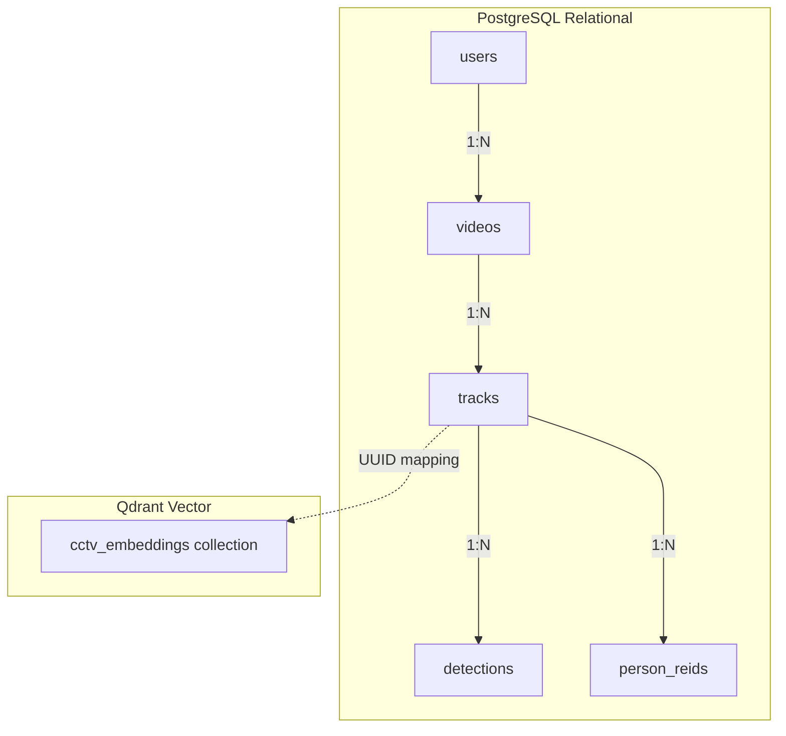

# 02_Database

## Purpose
The database layer serves to store relational structures (user details, video tracking, object bounding box offsets) in PostgreSQL, while offloading high-dimensional CLIP vectors to Qdrant to support fast semantic search.

## Problem Solved
Traditional relational databases struggle with high-dimensional vector search. Conversely, vector databases lack the query flexibility needed for relational tables. Using both PostgreSQL and Qdrant balances structural integrity and fast search.

## Dependencies
Requires the SQL Alchemy ORM, Alembic migrations framework, asyncpg PostgreSQL driver, and Qdrant Client.

## Architecture
The storage layout features two decoupled engines:

## Folder Structure
- `backend/app/db/session.py`: Async engine configuration.
- `backend/app/db/base_class.py`: Declarative base metadata mappings.
- `backend/app/models/`: Entity files (`user.py`, `video.py`, `track.py`).
- `backend/app/db/migrations/`: Alembic script configurations.

## Database Changes
### PostgreSQL Tables:
1. **`users`**: PK: `id` (UUID). Unique index on `email`.
2. **`videos`**: PK: `id` (UUID). FK: `uploaded_by` -> `users.id`.
3. **`tracks`**: PK: `id` (UUID). FK: `video_id` -> `videos.id`.
4. **`detections`**: PK: `id` (UUID). FK: `track_id` -> `tracks.id`.
5. **`person_reids`**: PK: `id` (UUID). FK: `track_id` -> `tracks.id`, `video_id` -> `videos.id`.

### Qdrant Collections:
- **`cctv_embeddings`**: Stores 512-dimensional CLIP vectors. Uses cosine distance.

## APIs
- The database is not exposed to the public. Internal connection is handled via `postgresql+asyncpg://` and Qdrant gRPC/HTTP channels.

## Processing Pipeline
1. Session Instantiation: `deps.get_db` yields an async transaction.
2. Commit Queue: Celery writes records inside `VideoProcessingOrchestrator`.
3. Transaction Commit: Executes PostgreSQL commits, then pushes points to Qdrant.
4. Rollback: Rolls back the SQL transaction if errors occur.

## AI Models Used
- OSNet generates 512d vectors stored in the `person_reids` table.
- CLIP generates 512d vectors indexed in Qdrant.

## Data Flow
- Bounding Box Outputs -> Write to PostgreSQL (`detections` table).
- Crop Image -> OSNet Vector -> Write to PostgreSQL (`person_reids` table).
- Crop Image -> CLIP Vector -> Write to Qdrant (`cctv_embeddings` collection).

## Configuration
- `POSTGRES_SERVER`, `POSTGRES_PORT`, `POSTGRES_USER`, `POSTGRES_PASSWORD`, `POSTGRES_DB` are parsed from `.env`.
- `QDRANT_HOST` (default: `localhost`), `QDRANT_PORT` (default: `6333`).

## Performance Optimizations
- **Connection Pooling**: Uses `pool_pre_ping=True` to detect dropped connections.
- **Async Mappings**: Employs asyncpg to support non-blocking queries.
- **Payload Indexing**: Configures Qdrant payload filters for faster query execution.

## Error Handling
- Database connection errors trigger API rollbacks.
- Alembic tracking failures occur if model files are not imported in `env.py`.

## Logging
- Connection pools and ORM statements log queries to the console when `echo` is active.

## Testing
- Verify schema integrity by running `alembic upgrade head` and checking the tables in a database tool.
- Run Qdrant collection checks via HTTP `/collections` queries.

## Known Limitations
- OSNet embeddings are stored in a standard PostgreSQL float array, which does not support fast cosine index lookups.

## Future Improvements
- Integrate `pgvector` in PostgreSQL to index and search OSNet vectors directly.

## Integration Notes
- Future modules (such as student profiles) must define tables that foreign-key map to `users.id` or `tracks.id`.

## Important Classes
- `Base`: ORM declarative metadata manager.
- `QdrantVectorStore`: Qdrant database wrapper.

## Important Functions
- `get_db`: Yields database connections.
- `_ensure_collection_exists`: Initializes Qdrant indexes.

## Sequence Diagram

## Mermaid Diagram

## Summary
The system uses PostgreSQL for relational data consistency and transaction management, and Qdrant to index high-dimensional CLIP vectors.
