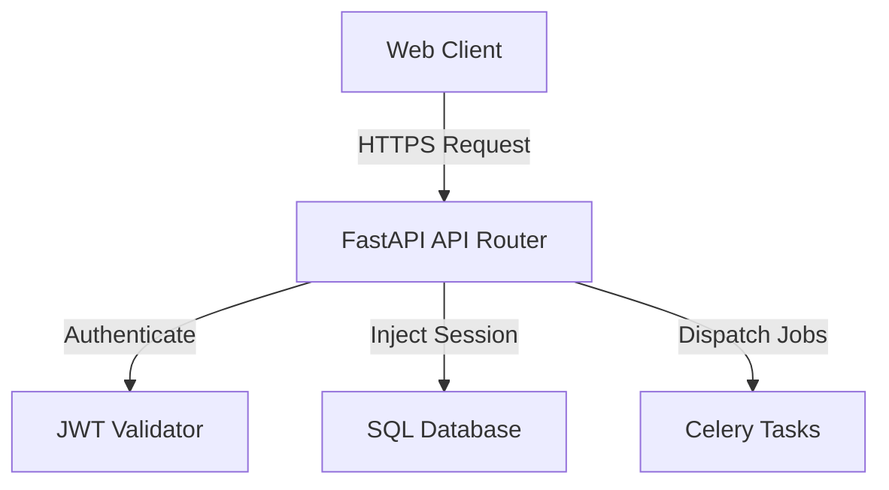
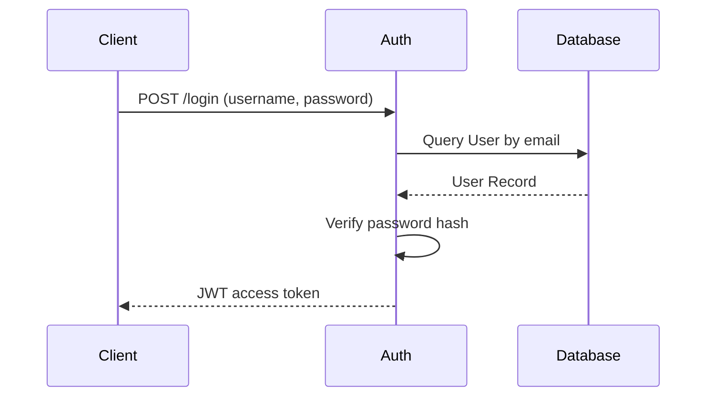
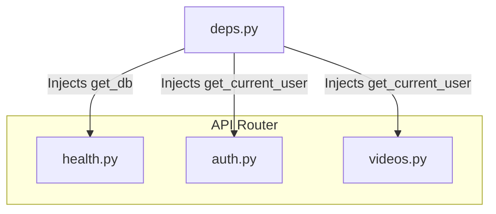

# 03_API_Documentation

## Purpose
The API layer defines the system's contract with external clients. It manages user registration, security authentication, video uploads, status tracking, search queries, and incident reporting.

## Problem Solved
Standardizes integration endpoints for web frontends, mobile devices, and camera integrations. It enforces authentication, parses incoming files, and coordinates background processing tasks.

## Dependencies
Requires the FastAPI routing framework, Pydantic schemas, and JWT library.

## Architecture
Exposed through Uvicorn. Intercepts incoming requests and routes them to version 1 endpoints.

## Folder Structure
- `backend/app/api/v1/auth.py`: Operators credentials validation routes.
- `backend/app/api/v1/health.py`: Status validation routes.
- `backend/app/api/v1/videos.py`: Ingestion and progress queries.
- `backend/app/schemas/`: Data shape validators.

## Database Changes
- Writes to `users` and `videos` tables during registration and upload actions.

## APIs
The backend implements the following routes:

### 1. Health
- **Endpoint**: `/api/v1/health`
- **Method**: `GET`
- **Purpose**: Diagnostic health checks.
- **Authentication**: None.
- **Request**: None.
- **Response**: `{"status": "healthy", "database": "connected", "service": "..."}`.
- **Error Codes**: `503 Service Unavailable` if database check fails.

### 2. Signup
- **Endpoint**: `/api/v1/auth/signup`
- **Method**: `POST`
- **Purpose**: Creates operator profile.
- **Authentication**: None.
- **Request**: `UserCreate` model (email, password, full_name).
- **Response**: `UserResponse` model.
- **Error Codes**: `400 Bad Request` if email already exists.

### 3. Login
- **Endpoint**: `/api/v1/auth/login`
- **Method**: `POST`
- **Purpose**: Authenticates operator and issues access token.
- **Authentication**: None.
- **Request**: OAuth2 Password Form (username, password).
- **Response**: `Token` schema.
- **Error Codes**: `400 Bad Request` for incorrect credentials or inactive status.

### 4. Upload Video
- **Endpoint**: `/api/v1/videos/upload`
- **Method**: `POST`
- **Purpose**: Ingests video file, saves to storage, and starts processing.
- **Authentication**: Bearer Token.
- **Request**: Multipart Form-data (`title`, `file` binary).
- **Response**: `VideoResponse` schema.
- **Error Codes**: `500 Internal Server Error` on disk write failures.

### 5. Video Status
- **Endpoint**: `/api/v1/videos/{video_id}/status`
- **Method**: `GET`
- **Purpose**: Polls pipeline stage and progress.
- **Authentication**: Bearer Token.
- **Request**: Path: `video_id`.
- **Response**: `VideoStatusResponse` schema.
- **Error Codes**: `404 Not Found`.

## Processing Pipeline
1. Incoming Request: Client submits a query or payload.
2. Dependency Execution: Injects database session (`get_db`) and parses JWT token (`get_current_user`).
3. Core Logic: Validates fields, executes database queries, or enqueues tasks.
4. Response Serialization: Transforms SQLAlchemy models into Pydantic models.

## AI Models Used
None in the API layer itself. Celery tasks handle model inference.

## Data Flow
- Request Payload -> Pydantic Validation -> DB Actions / Task Queues -> JSON Response.

## Configuration
- `settings.SECRET_KEY`: String value used to sign JWT signatures.
- `settings.ACCESS_TOKEN_EXPIRE_MINUTES`: Expiration time for access tokens.

## Performance Optimizations
- **Non-blocking Uploads**: Uses FastAPI UploadFile streams to read files in chunks, reducing memory footprints.
- **Response Caching**: Database outputs are converted directly into serialized schemas.

## Error Handling
- Exceptions are caught by `setup_exception_handlers` middleware and returned as `JSONResponse` messages.

## Logging
- Endpoints log client activities (e.g., upload initiations, user creations).

## Testing
- Run API integration tests using `pytest` or Python test scripts.
- Test endpoints interactively via the OpenAPI Swagger UI.

## Known Limitations
- No API rate limiting implemented.
- Lack of streaming media APIs to view processed videos.

## Future Improvements
- Add rate limiting middlewares.
- Implement secure file streaming routes.

## Integration Notes
- Future modules (such as Search or Reporting routers) should mount to the `v1` router inside [main.py](file:///c:/Users/Asus/OneDrive/Desktop/AI-Powered%20Smart%20CCTV%20Investigation%20System/backend/app/main.py).

## Important Classes
- `OAuth2PasswordRequestForm`: Handles login parses.
- `APIRouter`: Groups endpoints.

## Important Functions
- `get_current_user`: Validates JWT token signatures.

## Sequence Diagram

## Mermaid Diagram

## Summary
The API layer defines the entry point for system operations, utilizing JWT token verification to secure video ingestion and query routes.
