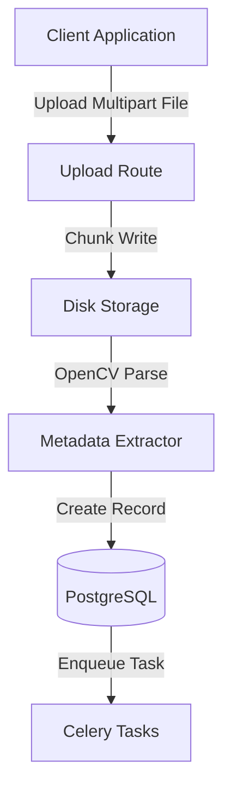
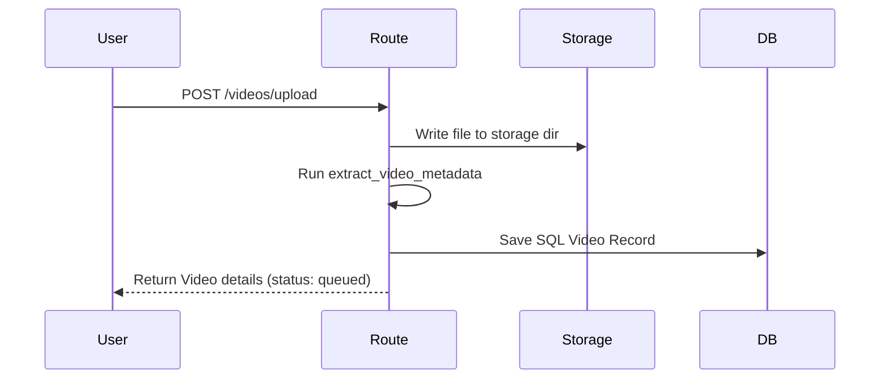
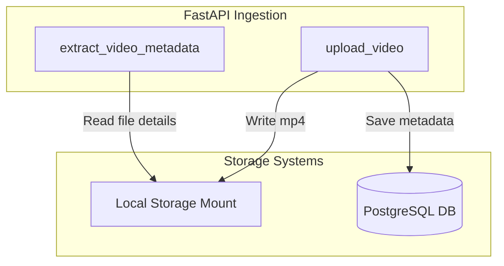

# 04_Video_Upload

## Purpose
The **Video Upload** feature allows operators to ingest video files (MP4/AVI/MKV), extract technical metadata (resolution, frame rate, duration, codec), register the files in PostgreSQL, and queue them for asynchronous processing.

## Problem Solved
Automates file writes to local disk storage, parses codec structures, and registers videos in the database. This creates a tracking record that the AI pipeline can reference during execution.

## Dependencies
Requires FastAPI Multipart upload dependencies, the OpenCV backend, and PostgreSQL tables.

## Architecture
This feature sits at the entrypoint of the ingestion pipeline.


## Folder Structure
- `backend/app/api/v1/videos.py`: Contains the `/upload` route.
- `backend/app/services/video_metadata.py`: Implements metadata extraction using OpenCV.
- `backend/app/models/video.py`: Database model for video metadata.
- `backend/app/schemas/video.py`: Request and response validation schemas.

## Database Changes
### Tables:
- **`videos`**: Creates a row with status set to `queued` and `progress_percentage` set to `0`. Populates fields like `width`, `height`, `duration`, `fps`, `codec`, and `file_size`.

## APIs
- **Endpoint**: `/api/v1/videos/upload`
- **Method**: `POST`
- **Purpose**: Uploads video file, saves it, extracts metadata, and enqueues a Celery processing task.
- **Authentication**: Bearer Token.
- **Request (Multipart)**:
  - `title` (optional string)
  - `file` (UploadFile binary)
- **Response**: `VideoResponse` (JSON representation of the database record).
- **Error Codes**:
  - `401 Unauthorized` if token is missing/invalid.
  - `500 Internal Server Error` if disk writes or enqueuing fails.

## Processing Pipeline
1. **Receive File**: FastAPI reads the multipart stream.
2. **Path Setup**: Generates a UUID for the file name to prevent name collisions.
3. **Disk Write**: Writes the file to the configured storage directory in 1MB chunks.
4. **Metadata Extraction**: OpenCV parses the file properties (width, height, FPS, frame count, codec).
5. **Database Entry**: Writes metadata to PostgreSQL and sets status to `queued`.
6. **Task Dispatch**: Calls `.delay()` on the Celery task, passing the video's database ID.

## AI Models Used
None. This is an ingestion and metadata extraction stage.

## Data Flow
- Binary Stream -> Disk File -> OpenCV Reader -> Metadata Dictionary -> SQL Record -> Celery task payload.

## Configuration
- `settings.STORAGE_DIR`: Local folder path for video storage.
- File write chunk size: `1024 * 1024` bytes (1 MB).

## Performance Optimizations
- **Stream Chunking**: Reads file streams in chunks to limit memory usage.
- **OpenCV Fast Close**: Releases OpenCV VideoCapture quickly to free system memory.

## Error Handling
- Disk write failures delete partially written files and raise an `HTTP_500_INTERNAL_SERVER_ERROR`.
- OpenCV extraction errors log warnings and fall back to file size stats, allowing the upload to complete.

## Logging
- Logs upload starts, saved file paths, metadata extraction results, and task enqueuing.

## Testing
- Test using `curl` or FastAPI Swagger documentation:
  ```bash
  curl -X POST "http://localhost:8000/api/v1/videos/upload" -H "Authorization: Bearer <token>" -F "file=@sample.mp4"
  ```

## Known Limitations
- The system does not validate file types or limit file upload sizes.
- Uploads are saved to local disks, which limits scaling out worker nodes.

## Future Improvements
- Add file type validation (e.g., block non-video uploads).
- Integrate cloud storage (such as AWS S3 or GCS) for scalability.

## Integration Notes
- Downstream modules can query the `videos` table to fetch the file path (`file_path`) and metadata.

## Important Classes
- `Video`: SQLAlchemy database model.
- `VideoResponse`: Pydantic validation schema.

## Important Functions
- `extract_video_metadata`: Parses video file details.
- `upload_video`: Coordinates the upload process.

## Sequence Diagram


## Mermaid Diagram


## Summary
The **Video Ingestion** feature processes uploaded files, extracts metadata, saves the file to local storage, and enqueues it for processing in the AI pipeline.
