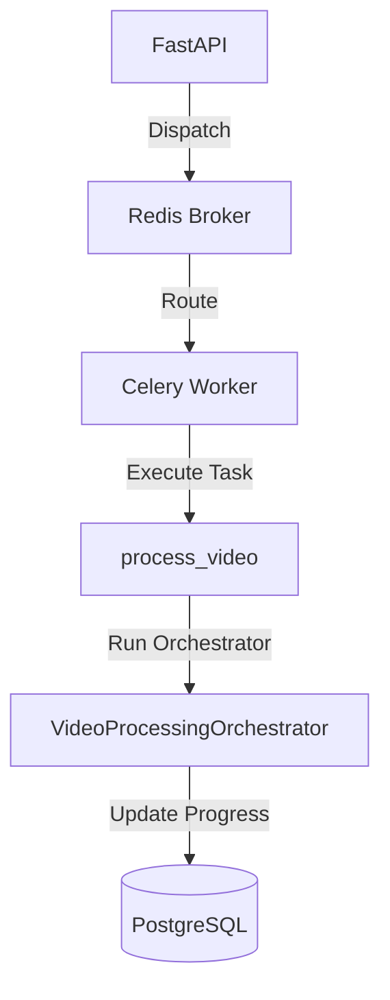
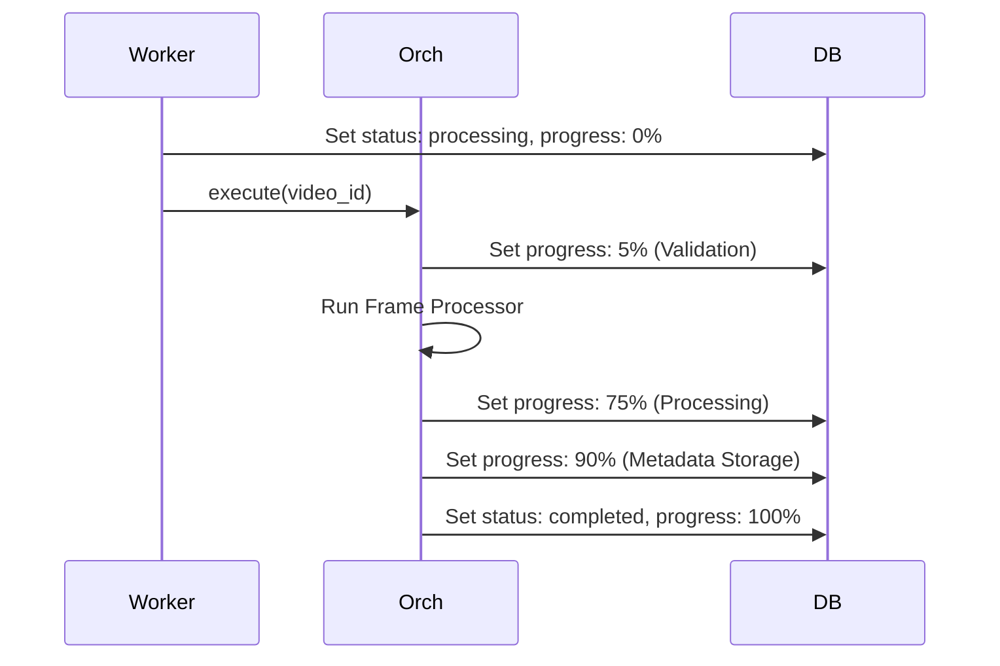
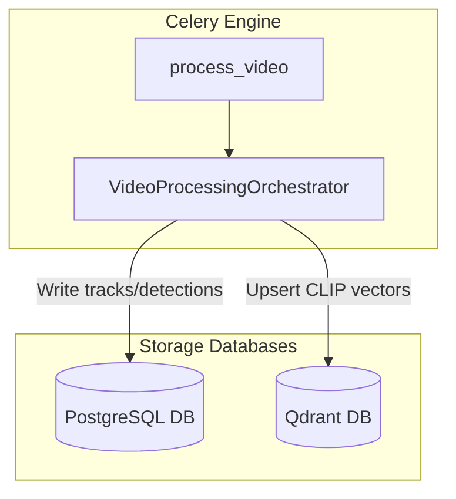

# 05_Celery_Pipeline

## Purpose
The **Celery Pipeline** handles background execution for video analytics. It coordinates tasks across workers, manages state transitions, and processes video streams using the system's AI models.

## Problem Solved
Asynchronously runs hardware-intensive tasks, such as YOLOv8 inference, OSNet feature extraction, and CLIP indexing, preventing resource exhaustion on the main FastAPI web server.

## Dependencies
Requires the Redis broker, SQLAlchemy database sessions, and the `VideoProcessingOrchestrator` service.

## Architecture
Managed by the Celery task manager, with Redis serving as the communication broker:


## Folder Structure
- `backend/app/tasks/cel_app.py`: Celery instance settings and queue routes.
- `backend/app/tasks/video_tasks.py`: Implements the `process_video` task.
- `backend/app/pipeline/orchestrator.py`: Coordinates the processing pipeline stages.

## Database Changes
### Tables:
- **`videos`**: The worker updates the `status` field (`queued` -> `processing` -> `completed`/`failed`), sets the active `current_stage` (e.g., Validation, Extraction, Metadata Storage), and tracks `progress_percentage`. If errors occur, it logs the stack trace in `error_message`.

## APIs
This background execution engine runs internally. It updates the database schema, which can be monitored via the HTTP API:
- **Route**: `GET /api/v1/videos/{video_id}/status`
- **Response**: Returns processing status and stage updates.

## Processing Pipeline
1. **Instantiation**: The task worker receives a video ID.
2. **Setup**: Starts transaction sessions and runs `VideoProcessingOrchestrator`.
3. **Execution Stages**:
   - **Stage 1 (Validation)**: Checks video file access (5% progress).
   - **Stage 2-4 (AI Engine)**: Downsamples frames, detects objects, associates trajectories, and runs Re-ID (75% progress).
   - **Stage 5 (CLIP Embeddings)**: Generates CLIP visual feature keys (80% progress).
   - **Stage 6 (Storage)**: Pushes trajectories to PostgreSQL and vectors to Qdrant (90% progress).
   - **Stage 7 (Completion)**: Sets status to `completed` (100% progress).

## AI Models Used
Coordinates execution for:
- YOLOv8 (Detector).
- ByteTrack (Tracker).
- OSNet (ReID extractor).
- CLIP (Semantic visual embedder).

## Data Flow
- Task Payload (video ID) -> Orchestrator validation -> Inference engines -> SQL transactions -> Qdrant indexing.

## Configuration
- `celery_app.conf.update`:
  - Timezone: `UTC`.
  - Worker prefetch multiplier: `1`.
  - Queue routes: maps `process_video` to the `video-processing` queue.
- `max_retries`: Set to 3 retry attempts for transient errors.
- `default_retry_delay`: Retries jobs after a 60-second delay.

## Performance Optimizations
- **Worker Prefetch Limit**: Limits prefetch settings to `1` to prevent a single worker from blocking other worker threads.
- **Batched Database Writes**: Performs bulk database writes to reduce transaction overhead.

## Error Handling
- Permanent errors (e.g., `FileNotFoundError` or `ValueError`) fail immediately, updating the video status to `failed` and logging the traceback.
- Transient errors trigger automatic retries (up to 3 attempts, delayed by 60 seconds) with the status set back to `queued`.

## Logging
- Logs task received events, stage progress updates, database updates, and failure traceback dumps.

## Testing
- Run celery workers locally:
  ```bash
  celery -A app.tasks.cel_app.celery_app worker --loglevel=info -Q video-processing
  ```
- Track tasks using dashboard utilities like Flower.

## Known Limitations
- The system lacks dynamic worker auto-scaling.
- The pipeline does not support distributed model execution across multiple nodes.

## Future Improvements
- Implement distributed worker queues to run models on dedicated servers.
- Add monitoring dashboards like Flower to local setups.

## Integration Notes
- Future modules can register new pipeline stages within `VideoProcessingOrchestrator` in [orchestrator.py](file:///c:/Users/Asus/OneDrive/Desktop/AI-Powered%20Smart%20CCTV%20Investigation%20System/backend/app/pipeline/orchestrator.py).

## Important Classes
- `VideoProcessingOrchestrator`: Coordinates the processing pipeline stages.

## Important Functions
- `process_video`: Runs the background task loop.
- `_update_video_progress`: Writes pipeline progress to the database.

## Sequence Diagram


## Mermaid Diagram


## Summary
The **Celery Pipeline** handles background execution for video analytics, managing tasks asynchronously and updating progress states in PostgreSQL and Qdrant.
