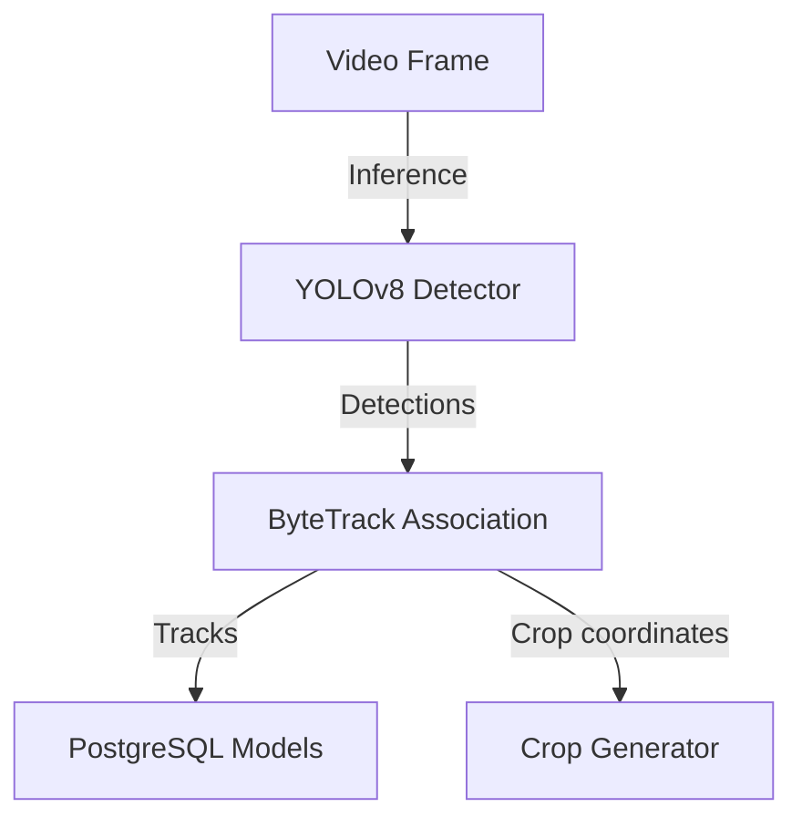
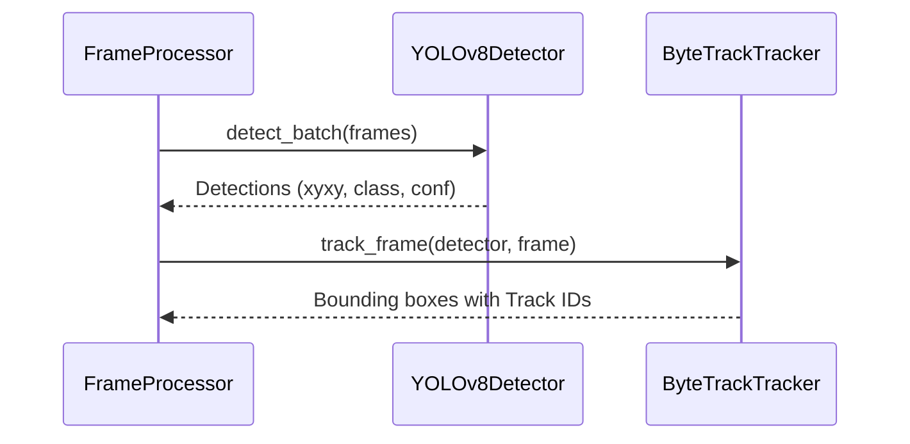
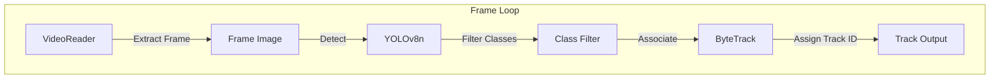

# 06_YOLO_ByteTrack

## Purpose
The **YOLO & ByteTrack** module performs object detection and spatial-temporal tracking. It detects target object classes on each frame and associates them across frames to build tracking trajectories.

## Problem Solved
Enables spatial-temporal localization of moving entities (people, vehicles, equipment) across frames. Tracking objects over time generates path history, allowing operators to analyze movement patterns.

## Dependencies
Requires the PyTorch framework, Ultralytics YOLOv8 library, OpenCV processing dependencies, and CUDA resources for acceleration.

## Architecture
Integrates into the system's frame processing workflow:


## Folder Structure
- `backend/app/pipeline/detector.py`: YOLOv8 class detector configurations.
- `backend/app/pipeline/tracker.py`: ByteTrack integration wrapper.
- `backend/app/pipeline/frame_processor.py`: Orchestrates detection and tracking loops.

## Database Changes
### Tables:
- **`tracks`**: Creates a row for each tracked object trajectory.
- **`detections`**: Stores individual bounding boxes, frame numbers, confidence scores, and timestamps.

## APIs
This background execution engine runs internally. It updates the database schema, which can be monitored via the HTTP API:
- **Route**: `GET /api/v1/videos/{video_id}/status`
- **Response**: Returns processing status and stage updates.

## Processing Pipeline
1. **Frame Read**: Fetches downsampled video frames from the frame generator.
2. **Inference**: Passes frames to the YOLOv8 model (`yolov8n.pt`).
3. **Class Filtering**: Filters detections to keep only target classes (e.g., person, vehicle, bag).
4. **Tracking**: Passes coordinates to ByteTrack to associate targets across frames and assign tracking IDs.
5. **Crop Generation**: Extracts image crops for detections with confidence scores of `0.5` or higher.
6. **Data Output**: Returns track records, detections, and crop locations to the orchestrator.

## AI Models Used
### 1. YOLOv8
- **Model**: `yolov8n.pt` (Nano model weights).
- **Target Classes**:
  - `0`: person, `1`: bicycle, `2`: car, `3`: motorcycle, `5`: bus, `7`: truck.
  - `24`: backpack, `26`: handbag, `28`: suitcase.
  - `63`: laptop, `67`: cell phone.
- **Hardware Acceleration**: Automatically runs on GPU via CUDA if available; otherwise falls back to CPU execution.
- **Precision**: Uses FP16 precision on CUDA.

### 2. ByteTrack
- **Configuration**: Uses `bytetrack.yaml` configuration parameters.
- **Logic**: Associates detections across frames using Kalman filters and Hungarian matching.

## Data Flow
- Frame Mat -> YOLO Inference -> Bounding Box coordinates -> ByteTrack -> Trajectory IDs and Crop boundaries.

## Configuration
- Target Classes: `[0, 1, 2, 3, 5, 7, 24, 26, 28, 63, 67]`.
- Crop Confidence Threshold: `0.5`.

## Performance Optimizations
- **FP16 CUDA Execution**: Uses FP16 half-precision on CUDA devices to reduce GPU memory usage.
- **Downsampling**: Processes videos at a target rate of 5 FPS to reduce compute overhead.

## Error Handling
- GPU memory allocation errors release the CUDA cache and fall back to CPU execution.
- Empty frames or decoding failures are skipped to prevent pipeline crashes.

## Logging
- Logs model initialization status, GPU usage configurations, frames processed counters, and queued crops metrics.

## Testing
- Test locally by running model evaluations on sample video files:
  ```python
  from app.pipeline.detector import YOLOv8Detector
  detector = YOLOv8Detector()
  res = detector.detect_batch([frame])
  ```

## Known Limitations
- The tracker can lose tracking IDs during occlusion or when targets leave the frame.
- Uses `yolov8n.pt` (Nano), which has lower detection accuracy for smaller objects than larger models.

## Future Improvements
- Add support for larger models (such as `yolov8m.pt`) to improve detection accuracy.
- Implement custom class training for campus-specific object types.

## Integration Notes
- Future modules can read tracking coordinates from PostgreSQL to analyze movement paths.

## Important Classes
- `YOLOv8Detector`: Implements detection logic.
- `ByteTrackTracker`: Implements tracking and association logic.

## Important Functions
- `track_frame`: Tracks objects in a single frame using ByteTrack.
- `detect_batch`: Runs batch inference on a list of frames.

## Sequence Diagram


## Mermaid Diagram


## Summary
The **YOLO & ByteTrack** module performs object detection and spatial-temporal tracking, generating tracking trajectories and crop frames for downstream embedding extraction.
