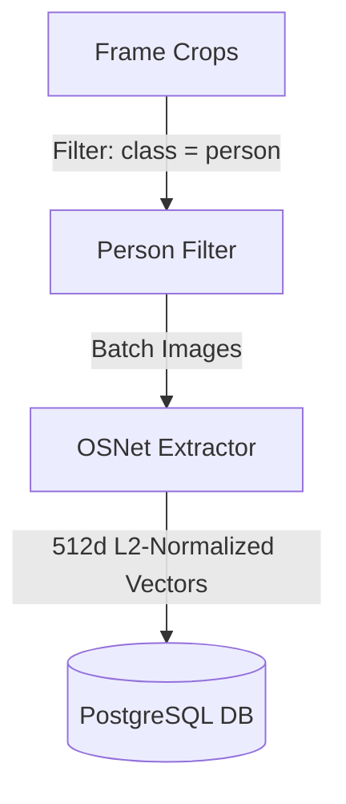
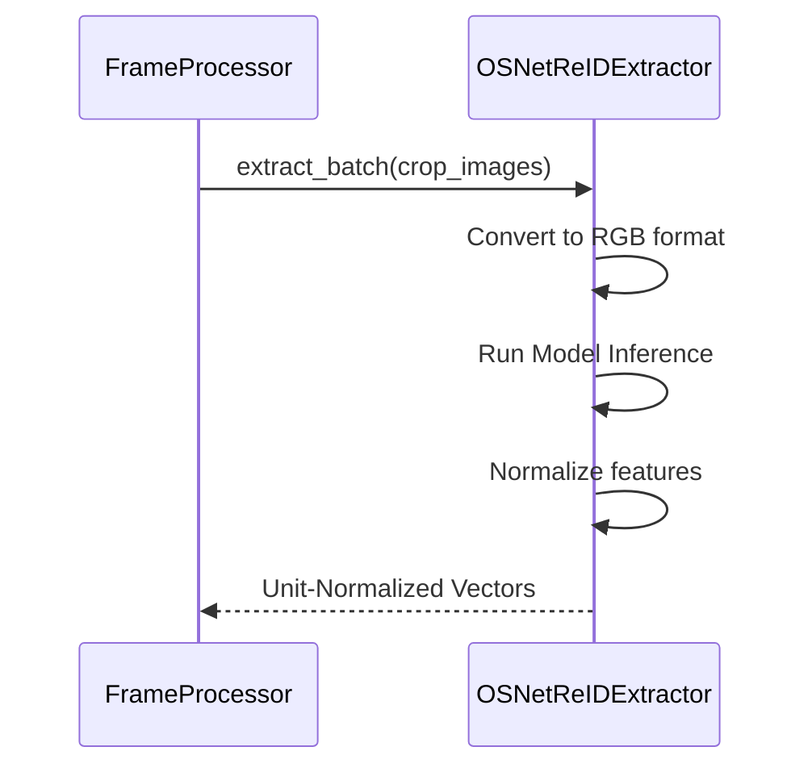

# 07_OSNet

## Purpose
The **OSNet** module handles person re-identification (Re-ID). It extracts 512-dimensional visual feature vectors from cropped images of detected people. This allows the system to identify and match the same person across different cameras.

## Problem Solved
Addresses the issue of target tracking discontinuity when people move through blind spots or transition between cameras. The system extracts visual signatures to match identities across multiple feeds without relying on facial recognition.

## Dependencies
Requires the PyTorchreid library, PyTorch framework, CUDA acceleration resources, and the YOLO-ByteTrack crop extractor.

## Architecture
Integrates into the system's video processing workflow:


## Folder Structure
- `backend/app/pipeline/reid.py`: Integrates OSNet and implements embedding extraction.
- `backend/app/models/track.py`: Defines the `PersonReid` database model.
- `backend/app/pipeline/frame_processor.py`: Coordinates crop extraction and extraction pipelines.

## Database Changes
### Tables:
- **`person_reids`**: Stores L2-normalized 512d vectors (`ARRAY(Float)`) along with crop file locations (`crop_path`), timestamps, and camera IDs.

## APIs
This background execution engine runs internally. It updates the database schema, which can be monitored via the HTTP API:
- **Route**: `GET /api/v1/videos/{video_id}/status`
- **Response**: Returns processing status and stage updates.

## Processing Pipeline
1. **Target Filtering**: Filters crop images from the frame processor, keeping only those classified as a `person`.
2. **Batch Ingestion**: Batches images (up to 64 crops) and converts them to RGB format.
3. **Inference**: Passes images to the OSNet feature extractor.
4. **L2 Normalization**: Normalizes vectors to unit length using L2 normalization to prepare them for cosine similarity calculations.
5. **Serialization**: Writes the generated vectors, crop paths, and camera IDs to the database.

## AI Models Used
### 1. OSNet
- **Model**: `osnet_x1_0` (weights from PyTorchreid).
- **Architecture**: Omni-Scale Network, specifically optimized for human re-identification.
- **Output Dimensionality**: 512 dimensions.
- **Device**: Automatically runs on GPU via CUDA if available; otherwise falls back to CPU execution.

## Data Flow
- Person Crop Image -> Color Space Conversion -> OSNet Model -> L2 Vector Normalization -> DB Record.

## Configuration
- Model name: `osnet_x1_0`.
- Batch size: `64` crops.
- Output dimensions: `512` floating point variables.

## Performance Optimizations
- **Batched Extraction**: Processes crops in batches of 64 to utilize GPU capabilities.
- **L2 Normalization**: Computes L2 normalization directly on the GPU using PyTorch operations.

## Error Handling
- Processes failing during inference log error details and return empty lists to prevent worker crashes.
- Disables model training mode (`eval()` mode) to prevent model parameter updates.

## Logging
- Logs extractor startup parameters, target device configurations, processed image counts, and inference errors.

## Testing
- Verify feature extraction by running manual extraction scripts:
  ```python
  from app.pipeline.reid import OSNetReIDExtractor
  extractor = OSNetReIDExtractor()
  embs = extractor.extract_batch([image])
  ```

## Known Limitations
- Background changes, illumination changes, and clothing variations can reduce matching accuracy.
- Requires high GPU resources when processing large batches of crop images.

## Future Improvements
- Implement `pgvector` indexing in PostgreSQL to support fast similarity queries.
- Add support for cross-video identity clustering to merge split trajectories.

## Integration Notes
- Future modules can search for matching people by comparing vectors to the `person_reids` table.

## Important Classes
- `OSNetReIDExtractor`: Implements feature extraction logic.
- `PersonReid`: SQLAlchemy database model.

## Important Functions
- `extract_batch`: Extracts unit-normalized Re-ID vectors from a batch of images.

## Sequence Diagram


## Mermaid Diagram


## Summary
The **OSNet** module extracts L2-normalized 512-dimensional visual feature vectors from cropped images of detected people, allowing the system to match identities across different cameras.
