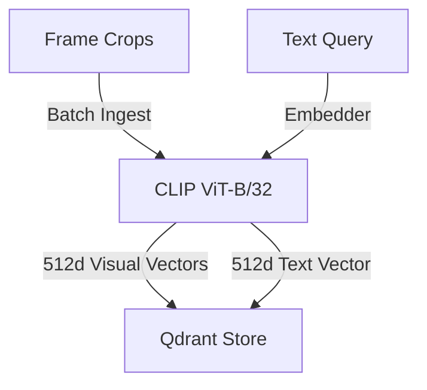
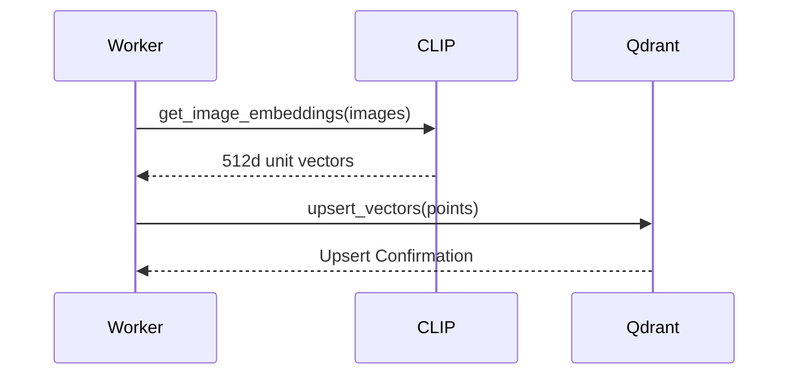
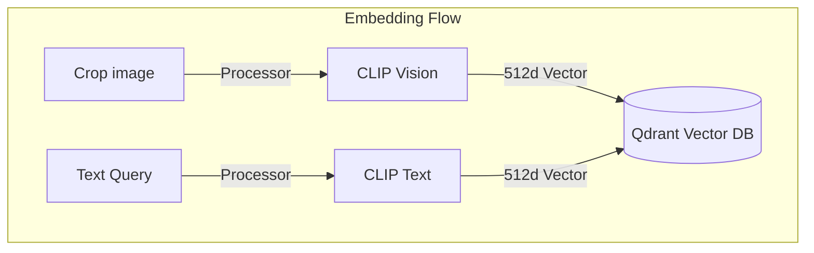

# 08_CLIP_Qdrant

## Purpose
The **CLIP & Qdrant** module maps visual entities to high-dimensional embeddings to enable semantic visual search. It indexes the generated vectors in Qdrant, allowing operators to run natural language search queries against video assets.

## Problem Solved
Traditional keyword indexing cannot map natural language text queries (such as *"a yellow truck"*) to visual assets. This module generates semantic visual embeddings for cropped images using the CLIP model and indexes them in Qdrant to support fast vector search.

## Dependencies
Requires the HuggingFace Transformers library, Qdrant Client API, PyTorch framework, and CUDA resources.

## Architecture
Integrates into the system's indexing and search pipelines:


## Folder Structure
- `backend/app/pipeline/embedder.py`: Handles image and text embedding generation.
- `backend/app/services/vector_store.py`: Implements the Qdrant database interface and metadata filters.

## Database Changes
### Qdrant Collections:
- **`cctv_embeddings`**: Stores 512-dimensional CLIP vectors. Uses cosine distance.
- **Payload Structure**:
  - `track_id`: UUID string referencing PostgreSQL tracks.
  - `video_id`: UUID string referencing PostgreSQL videos.
  - `timestamp`: Float offset in seconds.
  - `object_class`: String name of target category.
  - `camera_id`: Source identifier string.
  - `crop_path`: Saved file path for the crop.

## APIs
The database is not exposed to the public. Internal connection is handled via `QdrantClient` on port 6333:
- Exposes helper methods `search_by_embedding` and `search_by_text` within the codebase.

## Processing Pipeline
1. **Batching**: The processor batches crop images (up to 64 crops).
2. **Inference**: Passes images to the CLIP visual encoder (`openai/clip-vit-base-patch32`).
3. **L2 Normalization**: Unit-normalizes the visual embeddings to prepare them for cosine similarity calculations.
4. **Vector Upsert**: Formats payloads and upserts points to the Qdrant collection.
5. **Search Query**: Generates a text embedding from the search query and runs a vector similarity search in Qdrant, applying payload filters if provided.

## AI Models Used
### 1. CLIP
- **Model**: `openai/clip-vit-base-patch32` (pre-trained model).
- **Output Dimensionality**: 512 dimensions.
- **Device**: Automatically runs on GPU via CUDA if available; otherwise falls back to CPU execution.
- **Encoder Modes**:
  - `get_image_embeddings`: Generates embeddings for image arrays.
  - `get_text_embedding`: Generates embeddings for text queries.

## Data Flow
- Ingestion: Image Crop -> CLIP Image Encoder -> unit vector -> Qdrant.
- Query: Text Prompt -> CLIP Text Encoder -> unit vector -> Qdrant Cosine Search -> Payload Match list.

## Configuration
- Collection Name: `cctv_embeddings`.
- Vector size: `512` dimensions.
- Distance metric: `Cosine`.
- Ingestion batch size: `64` crops.

## Performance Optimizations
- **Image Preprocessing**: Pre-scales and pads images using CLIPProcessor before passing them to the model.
- **Payload Filtering**: Applies filters in Qdrant using payload attributes (e.g. camera, class, time ranges) during vector search to bypass search overhead.

## Error Handling
- Processes failing during inference log warning messages and return empty lists to prevent worker crashes.
- Vector upsert failures print traceback blocks and raise exception events.

## Logging
- Logs Qdrant collection initialization events, vector upsert metrics, search queries, filter builds, and execution durations.

## Testing
- Verify feature indexing by running test queries against the Qdrant container:
  ```python
  from app.services.vector_store import QdrantVectorStore
  store = QdrantVectorStore()
  res = store.search_by_text("red jacket", embedder)
  ```

## Known Limitations
- Background noise or objects that are too small can reduce the quality of the generated CLIP embeddings.
- Standard CLIP models can miss fine-grained local details (e.g., small brand logos).

## Future Improvements
- Upgrade to larger models (such as ViT-L/14) to improve semantic matching.
- Implement fine-tuning on domain-specific campus image datasets.

## Integration Notes
- Future modules can search indexed video segments by calling `search_by_text` or `search_by_embedding` methods.

## Important Classes
- `CLIPEmbedder`: Generates embeddings using the CLIP model.
- `QdrantVectorStore`: Implements the Qdrant database interface and search logic.

## Important Functions
- `get_image_embeddings`: Generates visual embeddings for a batch of images.
- `get_text_embedding`: Generates a semantic embedding for a text query.
- `upsert_vectors`: Pushes vectors and payloads to Qdrant.

## Sequence Diagram


## Mermaid Diagram


## Summary
The **CLIP & Qdrant** module maps visual entities to high-dimensional embeddings and indexes them in Qdrant, enabling semantic search capabilities for video assets.
