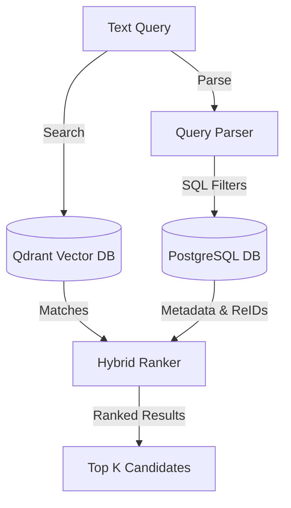
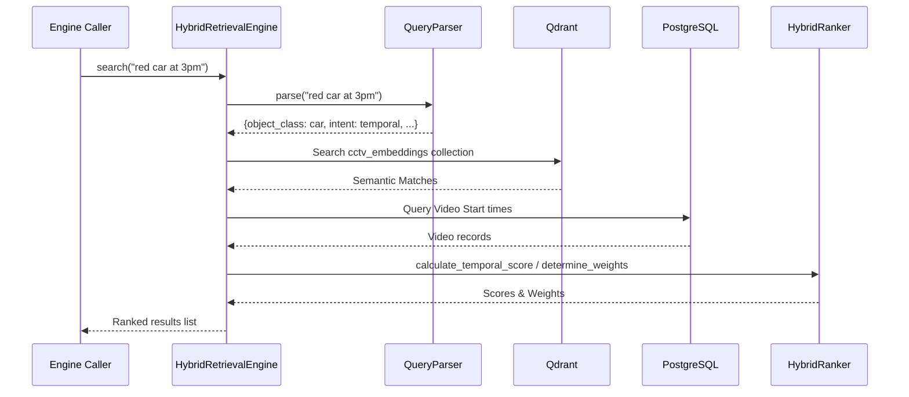
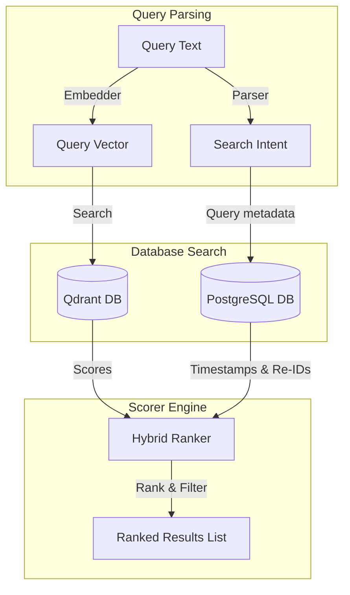

# 09_Hybrid_Retrieval

## Purpose
The **Hybrid Retrieval Engine** matches natural language search queries to visual events. It parses query parameters and constraints, searches Qdrant for semantic matches, queries PostgreSQL for temporal and visual identity constraints, and ranks outputs using adaptive weightings.

## Problem Solved
Text-only or vector-only queries can return inaccurate results. This engine combines semantic similarity (CLIP), visual identity similarity (OSNet), temporal constraints (e.g. *"before 2 PM"*), and metadata filters (camera ID, class) to return higher-quality search results.

## Dependencies
Requires the `QueryParser`, `HybridRanker`, `QdrantVectorStore`, and `CLIPEmbedder` modules.

## Architecture
Serves as the search and ranking engine for the system:


## Folder Structure
- `backend/app/services/hybrid_retrieval.py`: Implements the search engine logic.
- `backend/app/services/query_parser.py`: Parses query keywords, targets, and temporal constraints.
- `backend/app/services/ranking.py`: Computes individual scores and applies adaptive weights.

## Database Changes
- No structural model changes. Queries data from the `videos`, `tracks`, and `person_reids` tables.

## APIs
- Currently implemented as a service layer component. An API route (e.g., `GET /api/v1/search`) is planned to expose this engine to external clients.

## Processing Pipeline
1. **Query Parsing**: `QueryParser` extracts target classes (e.g., person, car), search intents (appearance, identity, temporal), and temporal constraints from the query text.
2. **Semantic Search**: Queries Qdrant for semantic matches, applying filters for target classes and metadata if provided.
3. **Relational Enrichment**: Queries PostgreSQL to fetch video start times and matching OSNet embeddings.
4. **Re-ID Prototype Generation**: If the query targets a `person`, the engine builds a visual Re-ID prototype vector by averaging the top 3 OSNet embeddings from the Qdrant results.
5. **Scoring**: Computes scores for each candidate:
   - **Semantic Score**: Qdrant cosine similarity.
   - **Identity Score**: Cosine similarity to the visual Re-ID prototype.
   - **Temporal Score**: Temporal match score computed using a Gaussian decay function.
   - **Metadata Score**: Structured property match score.
6. **Weighting & Ranking**: Calculates a weighted score using adaptive weights, sorts candidates, and returns the top K results.

## AI Models Used
- OSNet generates Re-ID vectors to calculate visual identity scores.
- CLIP generates visual embeddings to calculate semantic scores.

## Data Flow
- Query String -> Parser dictionary -> Qdrant search results -> PostgreSQL metadata queries -> Hybrid scorer calculations -> Ranked results lists.

## Configuration
- Default Scoring Weights:
  - Semantic: `0.6`
  - Identity: `0.2`
  - Temporal: `0.1`
  - Metadata: `0.1`
- Weight tuning based on intent:
  - **Appearance Intent**: Increases semantic weight (`0.7`).
  - **Identity Intent**: Increases identity weight (`0.4`).
  - **Temporal Intent**: Increases temporal weight (`0.5`).
  - **Non-person objects**: Sets identity weight to `0.0` and increases semantic weight (`0.8`).

## Performance Optimizations
- **Prototype Averaging**: Builds a visual Re-ID prototype by averaging the top 3 candidate vectors, reducing the need to run similarity queries against every database entry.
- **Payload Indexing**: Performs structural filtering directly in Qdrant to narrow the search space before running vector searches.

## Error Handling
- Queries returning no Qdrant matches exit early, logging search stats and returning empty lists.
- SQL parsing or database errors catch exceptions, log details, and roll back current transactions.

## Logging
- Logs parsed query parameters, query intents, calculated weights, candidate counts, and query execution times.

## Testing
- Verify search functionality by running test queries against the search engine:
  ```python
  from app.services.hybrid_retrieval import HybridRetrievalEngine
  engine = HybridRetrievalEngine(db_session)
  results = await engine.search("person in black jacket after 3 pm")
  ```

## Known Limitations
- The regex parser for temporal constraints can fail to parse non-standard temporal text formats (e.g., *"noon"* or *"midnight"*).
- Running database queries to construct Re-ID prototypes can increase search latency.

## Future Improvements
- Implement semantic query parsing using pre-trained NLP models.
- Support multi-camera tracking inputs during query creation.

## Integration Notes
- Future search APIs should instantiate `HybridRetrievalEngine` and return the ranked results list.

## Important Classes
- `QueryParser`: Parses query parameters and constraints.
- `HybridRanker`: Computes scores and manages adaptive weights.
- `HybridRetrievalEngine`: Orchestrates the search and ranking process.

## Important Functions
- `parse`: Parses query parameters and constraints.
- `determine_weights`: Updates weights dynamically based on intent and class.
- `calculate_temporal_score`: Computes temporal match scores using Gaussian decay models.
- `search`: Runs queries and returns ranked results.

## Sequence Diagram


## Mermaid Diagram


## Summary
The **Hybrid Retrieval Engine** parses natural language queries, queries PostgreSQL and Qdrant, and ranks candidates using adaptive weighting algorithms to return search results.
