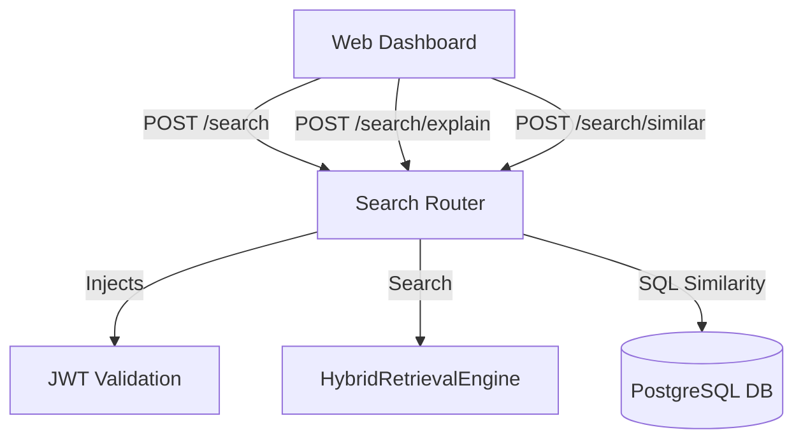
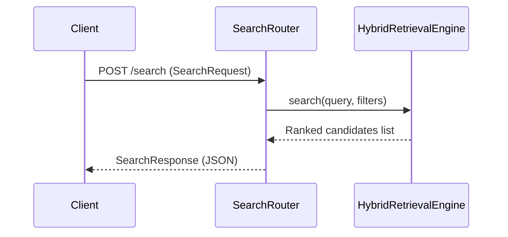
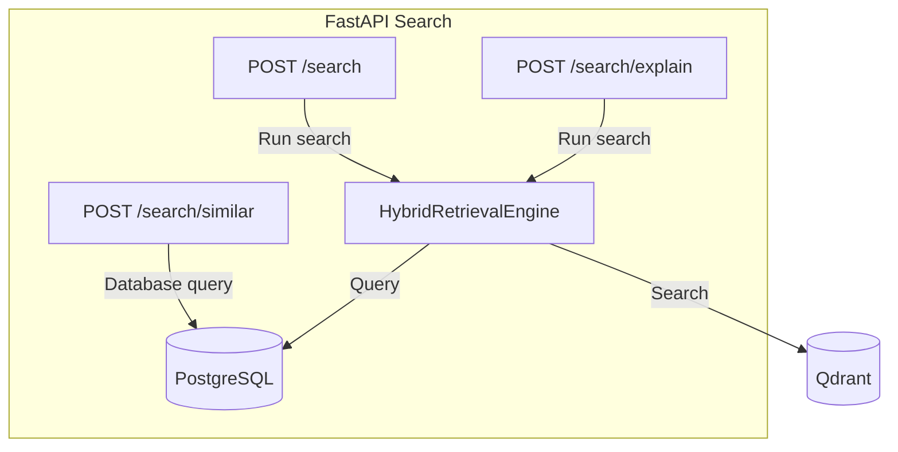

# 10_Search_API

## Purpose
The **Search API** exposes the system's search capabilities to external clients, allowing operators to run queries using natural language prompts, retrieve scoring breakdowns for transparency, and query visual similarity matches.

## Problem Solved
Bridges the gap between the headless backend engine services and external client applications. It provides structured validation schemas and JSON endpoints to parse prompts and query database assets.

## Dependencies
Requires the `HybridRetrievalEngine` service, FastAPI framework, Pydantic validation schemas, and database session bindings.

## Architecture
Exposed as a router module under `/api/v1/search`:


## Folder Structure
- `backend/app/api/v1/search.py`: Implements the endpoints.
- `backend/app/schemas/search.py`: Defines request/response validation schemas.

## Database Changes
- No schema structural alterations are required. Reads data from PostgreSQL (`tracks`, `person_reids`) and Qdrant collections.

## APIs

### 1. Natural Language Search
- **Endpoint**: `/api/v1/search`
- **Method**: `POST`
- **Purpose**: Runs natural language searches and returns ranked results.
- **Authentication**: Bearer Token.
- **Request**: `SearchRequest` (JSON body):
  - `query` (string, required): Search prompt.
  - `camera_id` (string, optional)
  - `video_id` (UUID, optional)
  - `object_class` (string, optional)
  - `start_time` (float, optional)
  - `end_time` (float, optional)
  - `top_k` (int, default: 10)
- **Response**: `SearchResponse` (JSON):
  - `results` (Array): Listed ranked track candidates.
- **Error Codes**:
  - `401 Unauthorized` for invalid sessions.
  - `422 Unprocessable Entity` for validation errors.
  - `500 Internal Server Error` on query failures.

### 2. Search Explanation
- **Endpoint**: `/api/v1/search/explain`
- **Method**: `POST`
- **Purpose**: Runs searches and returns score breakdowns and text explanations.
- **Authentication**: Bearer Token.
- **Request**: Same as `POST /api/v1/search`.
- **Response**: `ExplainResponse` (JSON):
  - `results` (Array of candidates containing scores mapping and text explanation string).

### 3. Similar Track Search
- **Endpoint**: `/api/v1/search/similar`
- **Method**: `POST`
- **Purpose**: Finds visually similar tracks using Re-ID embeddings.
- **Authentication**: Bearer Token.
- **Request**: `SimilarRequest` (JSON body):
  - `track_id` (UUID, required): The target track ID.
  - `top_k` (int, default: 10)
- **Response**: `SimilarResponse` (JSON) listing matched tracks sorted by similarity score.
- **Error Codes**:
  - `404 Not Found` if target track doesn't exist.
  - `400 Bad Request` if target track lacks Re-ID signatures.

## Processing Pipeline
- **POST /search**: Receives request -> validates payload -> runs hybrid search -> returns results.
- **POST /search/explain**: Receives request -> runs search -> queries track names -> generates explanations -> returns results.
- **POST /search/similar**: Receives track_id -> checks track existence -> pulls source embeddings -> averages and normalizes -> queries other tracks -> computes dot products -> groups and sorts -> returns top matches.

## AI Models Used
- OSNet and CLIP models generate visual embeddings used in the search engine's ranking calculations.

## Data Flow
- Inbound Request -> FastAPI Ingestion -> Query Parser -> Database Search -> Scorer -> Ranked Output.

## Configuration
- Default search result limit: `10`.
- Minimum candidate confidence threshold: `0.4`.

## Performance Optimizations
- **Prototype Averaging**: Builds a visual Re-ID prototype by averaging the top candidate vectors, reducing database query overhead.
- **Weights Caching**: Class-level caching inside `CLIPEmbedder` to prevent GPU/CPU reload timeouts.

## Error Handling
- Invalid inputs trigger `HTTP_422_UNPROCESSABLE_ENTITY` validation errors.
- Database query failures return `HTTP_500_INTERNAL_SERVER_ERROR` status responses.

## Logging
- Logs search terms, query filters, similarity matches, and query execution times.

## Testing
- Test endpoints using mock clients:
  ```python
  response = client.post("/api/v1/search", json={"query": "person in red"}, headers=auth_headers)
  assert response.status_code == 200
  ```

## Known Limitations
- The similarity search uses in-memory array operations, which can degrade performance under heavy search volumes.

## Future Improvements
- Implement search result caching to reduce database loads.
- Support facial image uploads to search for matching students.

## Integration Notes
- Frontend applications will query this endpoint to populate search result dashboards.

## Important Classes
- `SearchRequest`, `SearchResponse`, `ExplainResponse`, `SimilarResponse`: Pydantic validation models.

## Important Functions
- `search_videos`, `search_explain`, `search_similar`: API endpoint handlers.

## Sequence Diagram


## Mermaid Diagram


## Summary
The **Search API** exposes the system's search capabilities to external clients, allowing operators to run queries using natural language prompts, retrieve scoring breakdowns, and query visual similarity matches.
