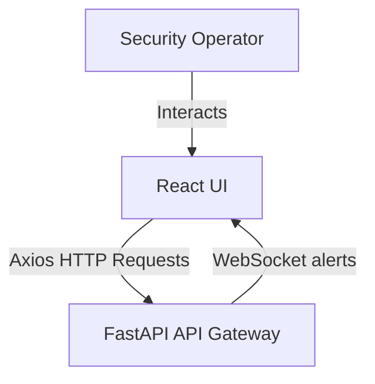
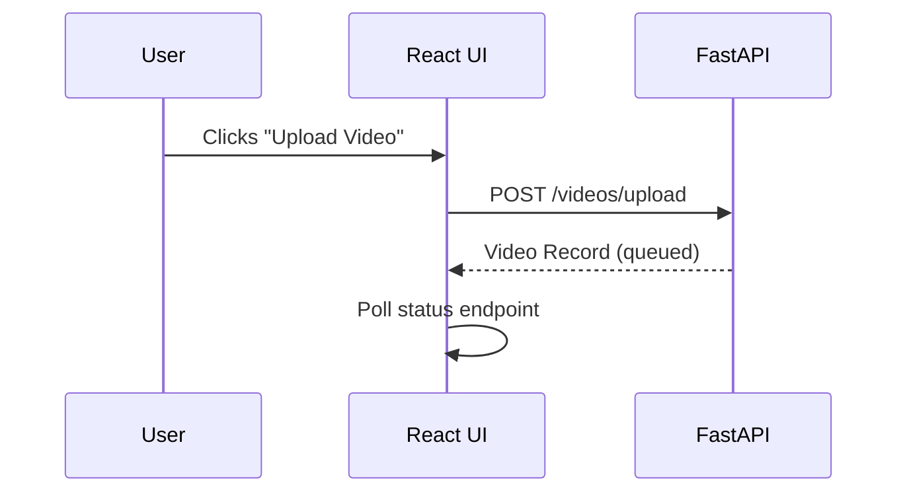
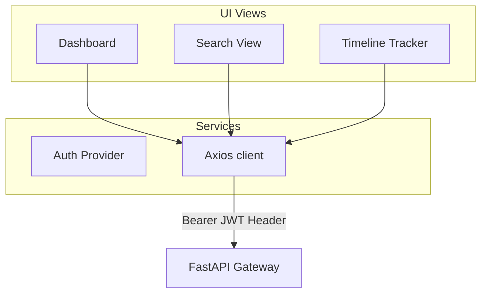

# 11_Frontend

## Purpose
The **Frontend** web application will serve as the user interface for campus operators. It will allow users to upload video files, monitor pipeline processing status, search video assets using natural language, and manage incidents.

## Problem Solved
Currently, the system is headless and has no user interface. This frontend will provide an operator interface to search video assets, manage uploads, view incident timelines, and export reports.

## Dependencies
Requires the React or Next.js framework, Vite build tool, TailwindCSS, and Axios API client.

## Architecture
Decoupled web application running on port 5173. Communicates with the FastAPI backend via REST APIs and WebSockets.

## Folder Structure
Proposed frontend layout:
- `frontend/src/components/`: Reusable UI components.
- `frontend/src/pages/`: Page views (e.g., Login, Dashboard, Search, Reports).
- `frontend/src/services/`: API client wrappers.
- `frontend/src/store/`: State management handlers.

## Database Changes
- No database schema changes are required. The frontend interacts with backend storage via REST APIs.

## APIs
- The application will run on `http://localhost:5173`.
- Communicates with the backend gateway on port `8000`.

## Processing Pipeline
1. **User Authentication**: Operator logs in to retrieve a JWT token, which is stored in local storage.
2. **Dashboard Management**: Lists uploaded videos and displays progress states.
3. **Search Console**: Operator enters queries in the search bar, calling the search endpoint to display results in a crop gallery.
4. **Timeline Builder**: Aggregates track coordinates to display target movement paths across campus.

## AI Models Used
None. The frontend only displays visual outputs and query results generated by backend AI pipelines.

## Data Flow
- User Input -> Axios API Call -> API Server -> JSON response payloads -> React state render.

## Configuration
- `VITE_API_URL`: Backend gateway endpoint.
- Poll interval: `2000ms` for video processing status.

## Performance Optimizations
- **Lazy Loading**: Uses lazy loading for visual assets to reduce page load times.
- **Visual Crop Caching**: Caches loaded crop assets in browser memory to reduce network requests.

## Error Handling
- Captures API errors and displays warning notifications.
- Automatically routes expired JWT sessions back to the login page.

## Logging
- Logs user navigation events and API interactions to the browser console.

## Testing
- Test UI components using Cypress, Jest, or Playwright.

## Known Limitations
- Not yet implemented.

## Future Improvements
- Add support for interactive campus maps showing camera location zones.
- Support video player overlays to show real-time bounding box outputs.

## Integration Notes
- The React build outputs will copy to backend static mounts or deploy to cloud hosting providers.

## Important Classes
- Not applicable for functional component architectures.

## Important Functions
- `fetchSearchResults` [NEW]: Fetches search results from the API.
- `uploadVideo` [NEW]: Handles video file uploads.

## Sequence Diagram

## Mermaid Diagram

## Summary
The **Frontend** web application will provide a dashboard for campus operators, allowing them to manage uploads, run searches, and view incident timelines.
