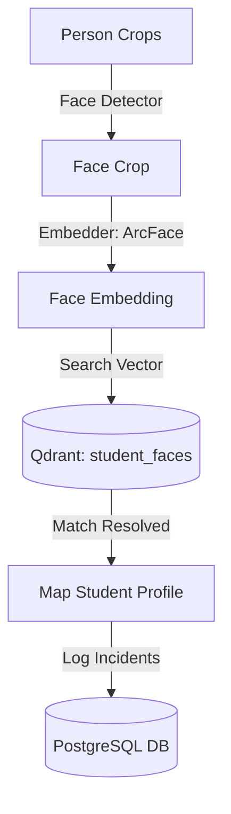
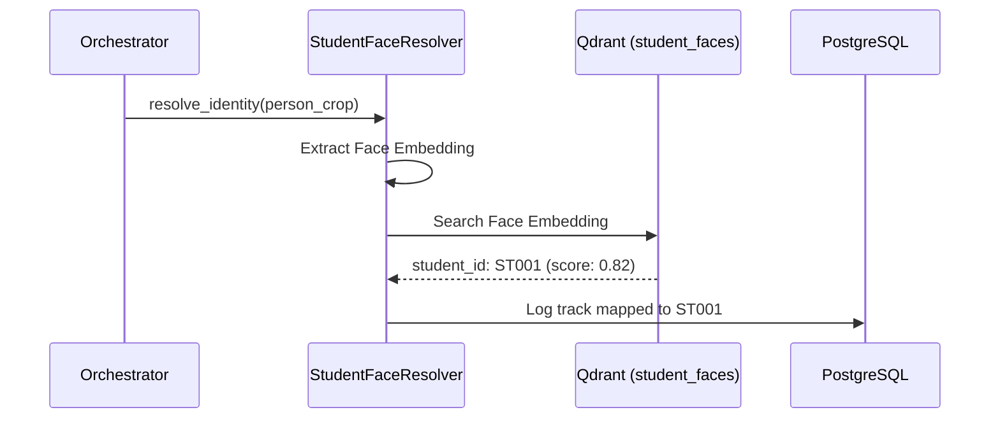
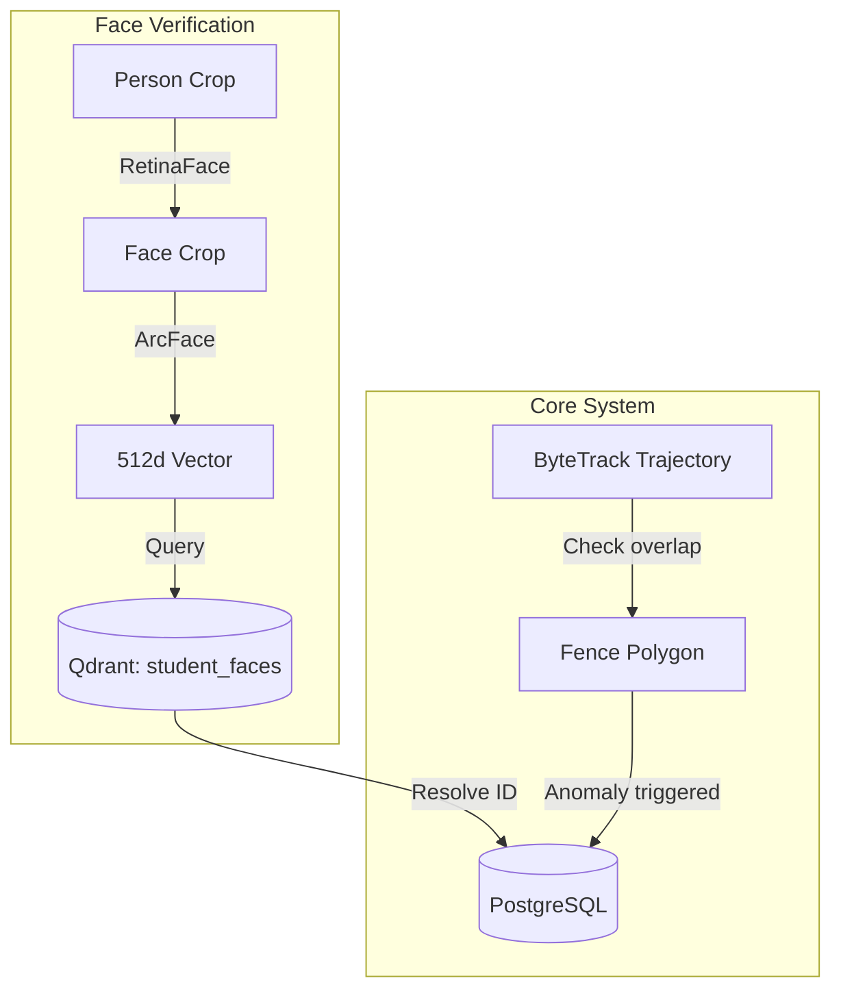

# 12_Student_Recognition

## Purpose
The **Student Identity Recognition & Investigation** module will link anonymous tracking trajectories to registered student profiles. It will allow operators to verify student identities, trace campus movements, and log security incidents (e.g., fence jumping or fights).

## Problem Solved
Currently, the system detects and tracks people, but cannot identify who they are. This module will map visual crop paths to actual student identities using face recognition models, helping operators identify individuals involved in campus incidents.

## Dependencies
Requires the `YOLOv8Detector` and `ByteTrackTracker` modules, along with facial detection (MTCNN/RetinaFace) and face embedding (ArcFace) libraries.

## Architecture
Integrates into the system's database and AI pipelines:


## Folder Structure
Proposed module files:
- `backend/app/pipeline/face.py` [NEW]: Implements facial crop and embedding generation.
- `backend/app/services/incident.py` [NEW]: Implements spatial fence crossing and fight detection logic.
- `backend/app/models/student.py` [NEW]: Defines SQL tables for students and incidents.

## Database Changes
Proposed database updates:

### PostgreSQL Tables:
1. **`students`**: Stores student profiles.
   - `id`: UUID (PK).
   - `student_code`: VARCHAR (Unique index).
   - `name`: VARCHAR.
   - `department`: VARCHAR.
2. **`student_faces`**: Maps faces to student records.
   - `id`: UUID (PK).
   - `student_id`: UUID references `students.id`.
   - `photo_path`: VARCHAR.
3. **`security_incidents`**: Logs detected security anomalies.
   - `id`: UUID (PK).
   - `anomaly_type`: VARCHAR ("fight", "fence_jump").
   - `student_id`: references `students.id` (Nullable).
   - `track_id`: references `tracks.id`.
   - `frame_number`: INTEGER.
   - `snapshot_path`: VARCHAR.

### Qdrant Collections:
- **`student_faces`**: Stores 512-dimensional ArcFace face embeddings linked to student IDs.

## APIs
Proposed endpoints:
- `POST /api/v1/students/enroll`: Registers a student and indexes their photo.
- `POST /api/v1/students/search-face`: Uploads a photo to search for matching students.
- `GET /api/v1/incidents`: Retrieves logged incidents and alert histories.
- `GET /api/v1/incidents/{incident_id}/report`: Exports incident summaries as PDF reports.

## Processing Pipeline
1. **Face Detection**: The pipeline extracts a facial region crop when a `person` is detected.
2. **Face Embedding**: ArcFace generates a 512-dimensional face embedding.
3. **Identity Resolution**: Searches the `student_faces` Qdrant collection to find matching profiles (similarity >= 0.6).
4. **Anomaly Tracking**:
   - **Fence Jump**: If a track trajectory crosses a defined fence boundary, the system logs an anomaly.
   - **Fight Detection**: A skeletal action model checks person trajectories and flags sudden skeletal velocity shifts.
5. **Serialization**: Writes the resolved student ID, anomaly logs, and camera captures to the database.

## AI Models Used
### 1. RetinaFace
- **Purpose**: Detects and isolates facial regions within person crops.

### 2. ArcFace
- **Model**: ResNet-50 ArcFace.
- **Output Dimensionality**: 512 dimensions.
- **Hardware Acceleration**: Automatically runs on GPU via CUDA if available.

### 3. YOLOv8-Pose
- **Purpose**: Tracks skeleton keypoints to detect rapid skeletal movement shifts (fights).

## Data Flow
- Ingest: Operator face photos -> RetinaFace -> ArcFace -> vector keys -> Qdrant.
- Pipeline: CCTV Frames -> YOLO-ByteTrack -> Person Crop -> Face Crop -> ArcFace vector query -> student ID resolution -> anomaly check -> SQL logs.

## Configuration
- Face matching confidence threshold: `0.6` (Cosine distance).
- Anomaly polygons: coordinate sets saved in the database.

## Performance Optimizations
- **Skip Frame Extraction**: Only runs face detection on the first few frames of a track to reduce compute overhead.
- **Batched Vector Search**: Runs facial searches in batches to optimize Qdrant queries.

## Error Handling
- Unidentified faces resolve to `unknown` and do not block the pipeline.
- Low-quality crops skip face extraction to prevent model issues.

## Logging
- Logs student enrollments, resolved identities, anomaly detections, and warning alerts.

## Testing
- Verify face verification by running test scripts:
  ```python
  res = face_resolver.resolve(crop)
  assert res.student_code == "ST001"
  ```

## Known Limitations
- Poor lighting, facial angles, and face masks can reduce matching accuracy.
- Requires high GPU memory resources when running face verification models.

## Future Improvements
- Add support for group verification models to search for multiple students.
- Implement clustering algorithms to group unidentified faces over time.

## Integration Notes
- This module will update the video orchestrator pipeline by inserting a face recognition stage after the tracking step.

## Important Classes
- `StudentFaceResolver` [NEW]: Resolves facial crops to student IDs.
- `IncidentDetector` [NEW]: Implements fence-crossing and fight detection logic.

## Important Functions
- `enroll_student` [NEW]: Registers student details and indexes their face embedding.
- `check_boundaries` [NEW]: Evaluates track trajectories against defined spatial boundaries.

## Sequence Diagram


## Mermaid Diagram


## Summary
The **Student Identity Recognition** module will link anonymous tracking data to student profiles, allowing operators to verify student identities and log campus incidents.
