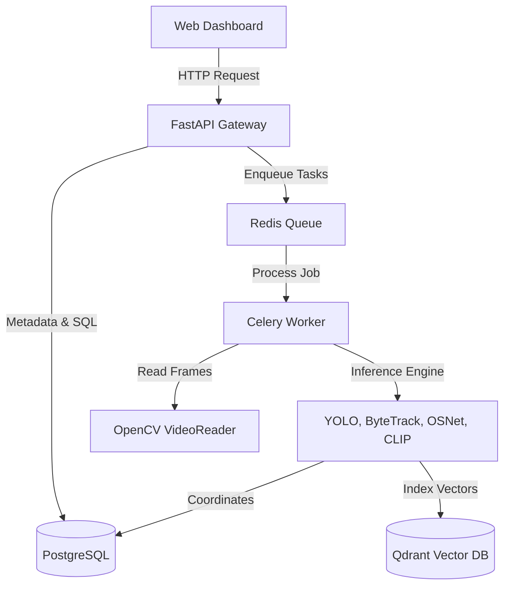

# AI_CONTEXT

This document serves as the guide for future AI coding agents. It provides a complete conceptual and implementation context of the **AI-Powered Smart Campus Surveillance & Investigation System** to enable continuous development without rereading the entire codebase.

---

## 1. Project Overview & Scope
The system is an automated campus-wide surveillance analysis and forensic investigation platform. It parses CCTV camera video feeds, tracks moving entities (people, vehicles, backpacks, cell phones), computes high-dimensional embeddings representing their physical appearance (OSNet Re-ID) and semantic features (CLIP), and stores these in a dual-storage backend.

Operators can upload video files and query the database using natural language text prompts (e.g., *"a person in a yellow jacket carrying a backpack before 3 PM"*). The system parses query intent, extracts temporal/metadata constraints, searches vectors in Qdrant, queries metadata in PostgreSQL, and aggregates candidate matches using an adaptive ranking algorithm.

---

## 2. Decoupled System Architecture
The system uses a decoupled, asynchronous, microservices-ready structure:
- **FastAPI**: Handles HTTP request routing, JWT security token validation, upload writes, and status checks.
- **Celery & Redis**: Offloads GPU/CPU-intensive video decoding and model inference to background workers to prevent blocking the web server.
- **PostgreSQL**: Stores relational camera data, video files metadata, track trajectories, and detection bounding boxes.
- **Qdrant**: Indexes 512-dimensional CLIP embeddings to support fast cosine similarity searches.



### Running Without Docker (Automatic Local Fallback Mode)
The system is built to support a zero-dependency, local execution mode. When the local environment does not have Docker running, or when explicitly configured via `.env` environment variables, the system automatically degrades gracefully:
- **SQLite + aiosqlite**: Substituted automatically for PostgreSQL if `DB_FALLBACK_SQLITE=true` or if PostgreSQL port connection fails. To support storing vectors and list matrices in SQLite, the system dynamically intercepts column declarations of type `ARRAY` (e.g. `StudentFaceEmbedding.embedding` and `PersonReid.embedding`) and compiles them as `JSON` using a custom `TypeDecorator` patch. SQLite tables are auto-created at startup.
- **In-Memory Qdrant**: Substituted automatically for a remote Qdrant server if `QDRANT_IN_MEMORY=true` or if the remote port connection fails. It operates using `QdrantClient(location=":memory:")` which initializes collections in-memory.
- **Celery Always Eager**: Substituted automatically for Redis if `CELERY_ALWAYS_EAGER=true` or if the Redis server port connection fails. Tasks are executed synchronously on the calling thread without requiring a running Celery worker or Redis broker.

---

## 3. Directory Layout Summary
- `backend/app/main.py`: Entry point mapping FastAPI routers.
- `backend/app/api/`: Endpoint definitions and dependencies.
  - `deps.py`: Exports database and authentication dependencies.
  - `v1/`: Implements API route groups.
    - [auth.py](file:///c:/Users/Asus/OneDrive/Desktop/AI-Powered%20Smart%20CCTV%20Investigation%20System/backend/app/api/v1/auth.py): Operator login, signup, and profile retrieval.
    - [health.py](file:///c:/Users/Asus/OneDrive/Desktop/AI-Powered%20Smart%20CCTV%20Investigation%20System/backend/app/api/v1/health.py): Database connection checks.
    - [videos.py](file:///c:/Users/Asus/OneDrive/Desktop/AI-Powered%20Smart%20CCTV%20Investigation%20System/backend/app/api/v1/videos.py): Handles video uploads, deletions, and status polling.
    - [search.py](file:///c:/Users/Asus/OneDrive/Desktop/AI-Powered%20Smart%20CCTV%20Investigation%20System/backend/app/api/v1/search.py): Natural language search, score explanation, and track similarity routes.
    - [students.py](file:///c:/Users/Asus/OneDrive/Desktop/AI-Powered%20Smart%20CCTV%20Investigation%20System/backend/app/api/v1/students.py): CRUD operations for student profiles and photo uploads.
- `backend/app/schemas/`: Pydantic V2 schemas for payload validation.
  - [search.py](file:///c:/Users/Asus/OneDrive/Desktop/AI-Powered%20Smart%20CCTV%20Investigation%20System/backend/app/schemas/search.py): Query structures, search outputs, and similarity mappings.
  - [student.py](file:///c:/Users/Asus/OneDrive/Desktop/AI-Powered%20Smart%20CCTV%20Investigation%20System/backend/app/schemas/student.py): Validation models for student CRUD and photo enrollment.
- `backend/app/core/`: Application settings and database sessions.
  - [config.py](file:///c:/Users/Asus/OneDrive/Desktop/AI-Powered%20Smart%20CCTV%20Investigation%20System/backend/app/core/config.py): Configuration parser loading environment variables.
  - [model_manager.py](file:///c:/Users/Asus/OneDrive/Desktop/AI-Powered%20Smart%20CCTV%20Investigation%20System/backend/app/core/model_manager.py): Centralized thread-safe singleton cache pre-loading all AI model weights.
  - [security.py](file:///c:/Users/Asus/OneDrive/Desktop/AI-Powered%20Smart%20CCTV%20Investigation%20System/backend/app/core/security.py): Password hashing and JWT generation.
  - [exceptions.py](file:///c:/Users/Asus/OneDrive/Desktop/AI-Powered%20Smart%20CCTV%20Investigation%20System/backend/app/core/exceptions.py): Validation exception handlers.
- `backend/app/db/`: SQL engines and schema migration scripts.
  - [base_class.py](file:///c:/Users/Asus/OneDrive/Desktop/AI-Powered%20Smart%20CCTV%20Investigation%20System/backend/app/db/base_class.py): Declarative base table pluralizer.
  - [session.py](file:///c:/Users/Asus/OneDrive/Desktop/AI-Powered%20Smart%20CCTV%20Investigation%20System/backend/app/db/session.py): Async engine connection sessions pool.
- `backend/app/models/`: SQLAlchemy tables mapping models.
  - [user.py](file:///c:/Users/Asus/OneDrive/Desktop/AI-Powered%20Smart%20CCTV%20Investigation%20System/backend/app/models/user.py): `User` entity definition.
  - [video.py](file:///c:/Users/Asus/OneDrive/Desktop/AI-Powered%20Smart%20CCTV%20Investigation%20System/backend/app/models/video.py): `Video` entity definition.
  - [track.py](file:///c:/Users/Asus/OneDrive/Desktop/AI-Powered%20Smart%20CCTV%20Investigation%20System/backend/app/models/track.py): Trajectory (`Track`), Bounding box (`Detection`), and visual appearance (`PersonReid`) models.
  - [student.py](file:///c:/Users/Asus/OneDrive/Desktop/AI-Powered%20Smart%20CCTV%20Investigation%20System/backend/app/models/student.py): Student (`Student`), photo enrollment (`StudentPhoto`), and face session status (`StudentFaceSession`) models.
  - [face_embedding.py](file:///c:/Users/Asus/OneDrive/Desktop/AI-Powered%20Smart%20CCTV%20Investigation%20System/backend/app/models/face_embedding.py): Stores student face embedding vectors and detection quality parameters.
  - [recognition.py](file:///c:/Users/Asus/OneDrive/Desktop/AI-Powered%20Smart%20CCTV%20Investigation%20System/backend/app/models/recognition.py): Stores CCTV student face recognition event matches.
  - [camera.py](file:///c:/Users/Asus/OneDrive/Desktop/AI-Powered%20Smart%20CCTV%20Investigation%20System/backend/app/models/camera.py): Camera records, calibrations, groups, and virtual zones.
  - [event.py](file:///c:/Users/Asus/OneDrive/Desktop/AI-Powered%20Smart%20CCTV%20Investigation%20System/backend/app/models/event.py): Surveillance alert event records and trajectory track links.
- `backend/app/event_engine/`: Extensible rules evaluation engines.
  - [event_engine.py](file:///c:/Users/Asus/OneDrive/Desktop/AI-Powered%20Smart%20CCTV%20Investigation%20System/backend/app/event_engine/event_engine.py): Coordinates analyzers and rule triggers.
  - [zone_analyzer.py](file:///c:/Users/Asus/OneDrive/Desktop/AI-Powered%20Smart%20CCTV%20Investigation%20System/backend/app/event_engine/zone_analyzer.py): Spatial polygon/line intersection checker.
  - [trajectory_analyzer.py](file:///c:/Users/Asus/OneDrive/Desktop/AI-Powered%20Smart%20CCTV%20Investigation%20System/backend/app/event_engine/trajectory_analyzer.py): Velocity and heading calculator.
  - [event_dispatcher.py](file:///c:/Users/Asus/OneDrive/Desktop/AI-Powered%20Smart%20CCTV%20Investigation%20System/backend/app/event_engine/event_dispatcher.py): Identifies targets and persists database alerts.
- `backend/app/pipeline/`: Deep learning processing pipelines.
  - [orchestrator.py](file:///c:/Users/Asus/OneDrive/Desktop/AI-Powered%20Smart%20CCTV%20Investigation%20System/backend/app/pipeline/orchestrator.py): Coordinates the 7 processing pipeline stages.
  - [face_engine.py](file:///c:/Users/Asus/OneDrive/Desktop/AI-Powered%20Smart%20CCTV%20Investigation%20System/backend/app/pipeline/face_engine.py): Lazy-loaded InsightFace detector and ArcFace embedding generator.
- `backend/app/services/`: Client integrations and helper scripts.
  - [vector_store.py](file:///c:/Users/Asus/OneDrive/Desktop/AI-Powered%20Smart%20CCTV%20Investigation%20System/backend/app/services/vector_store.py): Qdrant vector database query indexing wrapper.
  - [student_identifier.py](file:///c:/Users/Asus/OneDrive/Desktop/AI-Powered%20Smart%20CCTV%20Investigation%20System/backend/app/services/student_identifier.py): Real-time identification service matching person crops against Qdrant face collections.
  - [explanation_engine.py](file:///c:/Users/Asus/OneDrive/Desktop/AI-Powered%20Smart%20CCTV%20Investigation%20System/backend/app/services/explanation_engine.py): Multi-channel scoring aggregator resolving ArcFace, OSNet, CLIP, temporal, and zone logs.
  - [notification_service.py](file:///c:/Users/Asus/OneDrive/Desktop/AI-Powered%20Smart%20CCTV%20Investigation%20System/backend/app/services/notification_service.py): Live WebSocket manager broadcasting alert cards.
  - [alert_dispatcher.py](file:///c:/Users/Asus/OneDrive/Desktop/AI-Powered%20Smart%20CCTV%20Investigation%20System/backend/app/services/alert_dispatcher.py): Incident router mapping event categories to severity outputs.
- `backend/app/api/v1/`: API route controllers.
  - [cameras.py](file:///c:/Users/Asus/OneDrive/Desktop/AI-Powered%20Smart%20CCTV%20Investigation%20System/backend/app/api/v1/cameras.py): Handles camera CRUD operations and virtual zone configurations.
  - [events.py](file:///c:/Users/Asus/OneDrive/Desktop/AI-Powered%20Smart%20CCTV%20Investigation%20System/backend/app/api/v1/events.py): Queries incident alerts and supported classification types.
  - [notifications.py](file:///c:/Users/Asus/OneDrive/Desktop/AI-Powered%20Smart%20CCTV%20Investigation%20System/backend/app/api/v1/notifications.py): Exposes alert catalogs, unread settings, and live WebSocket gateway endpoint.
  - [reports.py](file:///c:/Users/Asus/OneDrive/Desktop/AI-Powered%20Smart%20CCTV%20Investigation%20System/backend/app/api/v1/reports.py): Generates and exports formatted PDF/HTML/JSON investigation reports.
  - [search.py](file:///c:/Users/Asus/OneDrive/Desktop/AI-Powered%20Smart%20CCTV%20Investigation%20System/backend/app/api/v1/search.py): Executes semantic and explainable adaptive search lookups.
  - [video_reader.py](file:///c:/Users/Asus/OneDrive/Desktop/AI-Powered%20Smart%20CCTV%20Investigation%20System/backend/app/pipeline/video_reader.py): Performs video frame downsampling.
  - [detector.py](file:///c:/Users/Asus/OneDrive/Desktop/AI-Powered%20Smart%20CCTV%20Investigation%20System/backend/app/pipeline/detector.py): YOLOv8 model configurations.
  - [tracker.py](file:///c:/Users/Asus/OneDrive/Desktop/AI-Powered%20Smart%20CCTV%20Investigation%20System/backend/app/pipeline/tracker.py): ByteTrack tracker configurations.
  - [reid.py](file:///c:/Users/Asus/OneDrive/Desktop/AI-Powered%20Smart%20CCTV%20Investigation%20System/backend/app/pipeline/reid.py): OSNet feature extractor.
  - [embedder.py](file:///c:/Users/Asus/OneDrive/Desktop/AI-Powered%20Smart%20CCTV%20Investigation%20System/backend/app/pipeline/embedder.py): CLIP visual/text embeddings wrapper.
  - [frame_processor.py](file:///c:/Users/Asus/OneDrive/Desktop/AI-Powered%20Smart%20CCTV%20Investigation%20System/backend/app/pipeline/frame_processor.py): Loop executing inference and generating crop files.
- `backend/app/tasks/`: Celery task workers.
  - [cel_app.py](file:///c:/Users/Asus/OneDrive/Desktop/AI-Powered%20Smart%20CCTV%20Investigation%20System/backend/app/tasks/cel_app.py): Configures Celery and routes tasks to queues.
  - [video_tasks.py](file:///c:/Users/Asus/OneDrive/Desktop/AI-Powered%20Smart%20CCTV%20Investigation%20System/backend/app/tasks/video_tasks.py): Runs video processing orchestration tasks on `gpu_queue`.
  - [cpu_tasks.py](file:///c:/Users/Asus/OneDrive/Desktop/AI-Powered%20Smart%20CCTV%20Investigation%20System/backend/app/tasks/cpu_tasks.py): CPU-bound utility execution tasks running on `cpu_queue`.
- `backend/app/services/`: Core logic and helper services.
  - [vector_store.py](file:///c:/Users/Asus/OneDrive/Desktop/AI-Powered%20Smart%20CCTV%20Investigation%20System/backend/app/services/vector_store.py): Implements the Qdrant client interface.
  - [query_parser.py](file:///c:/Users/Asus/OneDrive/Desktop/AI-Powered%20Smart%20CCTV%20Investigation%20System/backend/app/services/query_parser.py): Implements NLP query parser checks.
  - [ranking.py](file:///c:/Users/Asus/OneDrive/Desktop/AI-Powered%20Smart%20CCTV%20Investigation%20System/backend/app/services/ranking.py): Calculates scoring weights.
  - [hybrid_retrieval.py](file:///c:/Users/Asus/OneDrive/Desktop/AI-Powered%20Smart%20CCTV%20Investigation%20System/backend/app/services/hybrid_retrieval.py): Integrates search logic.

---

## 4. Technical Stack & Hardware Requirements
- **Language**: Python 3.12 (standard for FastAPI, machine learning libraries, Pytorch).
- **Web API**: FastAPI 0.110 (asynchronous execution, fast development, auto OpenAPI documentation, Pydantic V2 integration).
- **Asynchronous Execution**: Celery 5.3 + Redis 7 (robust background queue, worker scalability, handles hardware-intensive AI execution asynchronously to keep the main web loop non-blocking).
- **SQL Relational Database**: PostgreSQL 16 (robust transactional storage, supports array types for OSNet embeddings, reliable keys/foreign key cascades, JSON column types for bounding boxes).
- **Vector Database**: Qdrant (purpose-built vector search, support for filtering payload while executing vector index lookup, cosine similarity, REST/gRPC APIs).
- **Detection & Tracking**: Ultralytics YOLOv8 (`yolov8n.pt`) and ByteTrack.
- **Visual Identity (Re-ID)**: PyTorchreid OSNet (`osnet_x1_0`).
- **Semantic Text-to-Image Embeddings**: Transformers CLIP (`openai/clip-vit-base-patch32`).
- **Containerization**: Docker & Docker Compose.

---

## 5. Storage Schemas & Mappings

### PostgreSQL Relational Schema:
- **`users`**: PK `id` (UUID). Relational map: One-to-Many to `videos`.
- **`videos`**: PK `id` (UUID). FK `uploaded_by` -> `users.id`. Tracks file attributes and processing status (queued, processing, completed, failed).
- **`tracks`**: PK `id` (UUID). FK `video_id` -> `videos.id`. Represents a single spatial-temporal trajectory.
- **`detections`**: PK `id` (UUID). FK `track_id` -> `tracks.id`. Tracks frame-level bounding boxes `[x1, y1, x2, y2]` in JSON.
- **`person_reids`**: PK `id` (UUID). FK `track_id` -> `tracks.id`, `video_id` -> `videos.id`. Stores unit-normalized 512-dimensional arrays from OSNet.

### Qdrant Vector Collection:
- Collection name: `cctv_embeddings`.
- Vector dimension: 512.
- Distance metric: Cosine.
- Payload parameters: `track_id`, `video_id`, `timestamp`, `object_class`, `camera_id`, `crop_path`.

---

## 6. Detailed AI processing flow

```text
1. upload_video (FastAPI)
   ├─ Save multipart file to settings.STORAGE_DIR
   ├─ Extract width/height/fps/duration/codec via OpenCV
   ├─ Save Video record (status="queued", progress=0)
   └─ Dispatch process_video Celery task

2. process_video (Celery Worker)
   ├─ Set status="processing", progress=0, current_stage="Initialization"
   ├─ Instantiate VideoProcessingOrchestrator
   ├─ Validate file exists (progress=5%)
   ├─ Execute FrameProcessor:
   │  ├─ VideoReader reads frames, downsampling to target_fps (5.0 FPS)
   │  ├─ YOLOv8 detects targets (filtered to categories: person, car, bag, etc.)
   │  ├─ ByteTrack associates trajectories and assigns IDs
   │  └─ Extracts crop image arrays for crops with confidence >= 0.5
   ├─ Image crops are written to disk: "storage/crops/{video_id}/{track_id}_{frame_num}_{hash}.jpg"
   ├─ Batch CLIP embeddings (openai/clip-vit-base-patch32) are generated (batch_size=64)
   ├─ Batch OSNet Re-ID embeddings (osnet_x1_0) are generated for "person" class crops
   ├─ Write tracking results, detections, and ReIDs to PostgreSQL
   ├─ Index CLIP visual embeddings in Qdrant (cctv_embeddings collection)
   └─ Update Video record (status="completed", progress=100)

---

## 6.5 Student Face Enrollment & Bulk Import System
1. **Student Registration**: Ingests individual student records or batch spreadsheet imports via `POST /students/import` utilizing Pandas spreadsheet parsing.
2. **ZIP Dataset Uploads**: Bulk photo directories matching folder names to student Roll Numbers are uploaded, uncompressed to a temp workspace, and registered as `StudentPhoto` database instances.
3. **Face Compile Tasks**: Background tasks (`bulk_enroll_faces_task`) run on the `gpu_queue` to perform:
   - OpenCV image read and InsightFace face coordinates extraction.
   - Bounding box checks and Laplacian blur scores calculation.
   - 512-dimensional ArcFace normalization vector extraction.
   - Dual storage indexing: writing to PostgreSQL `student_face_embeddings` and upserting payload vectors to Qdrant collection `student_face_embeddings`.
4. **ETA & Cancellation Tracking**: Progress status, processing roll numbers, cancellation requests, and CSV diagnostics are updated inside PostgreSQL `bulk_import_jobs`.

---

## 7. Known Architectural Issues & Setup Bugs

Before developing new features, check for and resolve these existing bugs:

1.  **Alembic Migration Failure (Missing Model Import)**:
    *   **File**: `backend/app/db/migrations/env.py`.
    *   **Bug**: The [PersonReid](file:///c:/Users/Asus/OneDrive/Desktop/AI-Powered Smart CCTV Investigation System/backend/app/models/track.py#L48) model is **not imported** in `env.py`. Because of this, Alembic will fail to track `person_reids` and will omit the table from autogenerated migrations, causing database-level errors when the pipeline writes tracking results.
    *   **Fix**: Add `from app.models.track import PersonReid` to `backend/app/db/migrations/env.py`.
2.  **Missing Migrations Versions Directory**:
    *   **Bug**: The `backend/app/db/migrations/versions` subdirectory is missing from the repository, which will cause Alembic file write operations to fail.
    *   **Fix**: Create the `versions/` subdirectory inside `backend/app/db/migrations/`.
3.  **Missing Requirements**:
    *   **Bug**: The libraries `ultralytics` and `torchreid` (and dependencies like `torchvision`) are imported in the codebase but missing from `requirements.txt`.
    *   **Fix**: Add these dependencies to `requirements.txt`.
4.  **Hardcoded Camera ID**:
    *   **File**: [frame_processor.py](file:///c:/Users/Asus/OneDrive/Desktop/AI-Powered Smart CCTV Investigation System/backend/app/pipeline/frame_processor.py).
    *   **Bug**: Camera ID is hardcoded to `"cam_1"`. The API should support a query param to dynamically assign camera IDs.
    *   **Fix**: Add a `camera_id` field to the `Video` model and pass it dynamically during upload.
5.  **Disk I/O Embeddings Bottleneck**:
    *   **Bug**: Bounding box crops are written to the local disk during tracking, then read back into memory to generate CLIP and OSNet embeddings. This disk I/O degrades performance.
    *   **Fix**: Pass crop arrays directly in memory via lists, and write assets to the storage mount asynchronously.

---

## 8. Coding Conventions & Best Practices

1.  **Asynchronous Mappings**: Always use SQLAlchemy `AsyncSession` for relational database operations inside the API layers.
2.  **Explicit Type Annotations**: Define explicit type annotations for function parameters and return types. Use Pydantic models for request/response serialization.
3.  **Pydantic V2 Usage**: System schemas must use Pydantic V2 configurations:
    ```python
    class SchemaResponse(BaseModel):
        model_config = ConfigDict(from_attributes=True)
    ```
4.  **Preserve Comments**: Preserve all existing comments and docstrings when making changes.
5.  **Separate Model Inference**: Use PyTorch `torch.no_grad()` blocks and call `torch.cuda.empty_cache()` inside processing tasks to optimize GPU memory usage.
6.  **Path Configurations**: When defining local directory paths on Windows, use forward slashes (e.g. `file:///C:/absolute/path`) to ensure compatibility with development tooling.

---

## 9. Design Decisions & System Integrations

### Database Routing & Session Creation
- Use `deps.get_db` to fetch database sessions in the API layer.
- Use `SessionLocal()` direct contexts to fetch database sessions inside background Celery worker tasks.

### Vector Search Score Calculation
- Calculate weighted scores using the `HybridRanker` weights configuration:
  $$\text{hybrid\_score} = w_s \cdot S_{\text{semantic}} + w_i \cdot S_{\text{identity}} + w_t \cdot S_{\text{temporal}} + w_m \cdot S_{\text{metadata}}$$
- Temporal decay calculates temporal match scores using Gaussian decay models:
  $$S_{\text{temporal}} = \exp\left(-0.5 \cdot \left(\frac{\Delta t}{0.5}\right)^2\right)$$

### Exposing Search and Media APIs
- Exposes `POST /api/v1/search`, `POST /api/v1/search/explain`, and `POST /api/v1/search/similar` endpoints in [search.py](file:///c:/Users/Asus/OneDrive/Desktop/AI-Powered%20Smart%20CCTV%20Investigation%20System/backend/app/api/v1/search.py).
- Reuses the `HybridRetrievalEngine` to parse prompts and filter indexed vector payloads.
- Validates queries and returns payload structures using schemas in [search.py](file:///c:/Users/Asus/OneDrive/Desktop/AI-Powered%20Smart%20CCTV%20Investigation%20System/backend/app/schemas/search.py).
