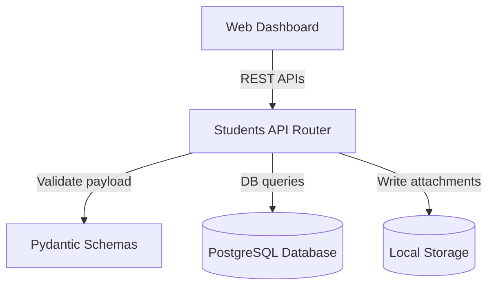

# F12: Student Management Module

## Purpose
The **Student Management Module** handles the registration and administrative tracking of campus student profiles and photo enrollment datasets. This module acts as the data repository for future facial recognition (e.g., ArcFace, InsightFace) verification features.

## Scope
This feature manages database records and file attachments only. It does **not** generate facial embeddings or run detection algorithms yet.

## Architecture


## Folder Structure
- `backend/app/models/student.py`: Declares `Student`, `StudentPhoto`, and `StudentFaceSession` SQLAlchemy models.
- `backend/app/schemas/student.py`: Implements validation schemas.
- `backend/app/api/v1/students.py`: Configures CRUD routes and photo handlers.
- `storage/students/{student_id}/{view}/`: Disk storage layout for attachments.

## Database Tables

### 1. `students`
Tracks basic enrollment details:
- `id` (UUID, PK)
- `university_roll_number` (String, Unique, Indexed)
- `name` (String, Indexed)
- `department` (String)
- `programme` (String)
- `year` (Integer)
- `semester` (Integer)
- `section` (String)
- `email` (String, Unique, Indexed)
- `phone` (String, Nullable)
- `status` (String, Default: `"active"`)

### 2. `student_photos`
Tracks uploaded image files:
- `id` (UUID, PK)
- `student_id` (UUID, FK to `students.id`)
- `photo_path` (String, Unique)
- `view` (String: `front`, `left`, `right`, `up`, `down`, `masked`, `glasses`, `unknown`)
- `file_size` (BigInteger)
- `mime_type` (String)
- `md5_hash` (String, Indexed)
- `metadata_json` (JSON, Nullable)

### 3. `student_face_sessions`
Tracks status of the face enrollment pipelines:
- `id` (UUID, PK)
- `student_id` (UUID, FK to `students.id`)
- `status` (String: `pending`, `completed`, `failed`)

---

## REST Endpoints

### 1. Student Profiles CRUD
- `POST /api/v1/students`: Registers a new student. Checks uniqueness of roll number and email.
- `GET /api/v1/students`: Paginated search with filtering (department, programme, year, semester, status) and sorting parameters.
- `GET /api/v1/students/{id}`: Fetch single profile.
- `PUT /api/v1/students/{id}`: Modify fields. Checks unique constraints on updated fields.
- `DELETE /api/v1/students/{id}`: Cascade deletes all DB records and removes `storage/students/{id}/` folder from disk.

### 2. Student Photo Enrollment
- `POST /api/v1/students/{id}/photos`: Upload multi-part photo attachments.
  * Validates size (< 5MB).
  * Validates MIME (JPEG, PNG).
  * Calculates MD5 hash to prevent duplicate uploads.
  * Automatically resolves view from query params or filename keywords.
- `GET /api/v1/students/{id}/photos`: Retrieves all enrolled photos.
- `DELETE /api/v1/students/{id}/photos`: Clear all photos or filter deletion by view.

---

## File Storage Layout
Photos are stored under the local `storage/` directory using this layout:
```
storage/
  students/
    {student_uuid}/
      front/
        {photo_uuid}.jpg
      left/
        {photo_uuid}.png
      right/
        {photo_uuid}.jpg
```
This isolates each student's views into clean sub-folders.
