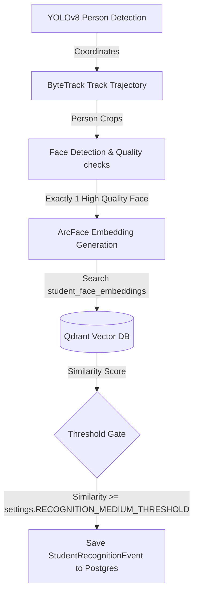

# F15: Real-Time Student Identification Engine

## Purpose
The **Real-Time Student Identification Engine** matches persons detected in surveillance video trajectories against the database of enrolled students' face embeddings, logging appearance events.

---

## 1. Flowchart & Pipeline Architecture

---

## 2. Confidence Threshold Classifications
Identification confidence is categorized dynamically based on cosine similarity scores:
1. **High Confidence**: Similarity $\ge 0.75$ (configurable via `settings.RECOGNITION_HIGH_THRESHOLD`).
2. **Medium Confidence**: Similarity $\ge 0.60$ (configurable via `settings.RECOGNITION_MEDIUM_THRESHOLD`).
3. **Unknown**: Similarity $< 0.60$, matching records are not considered positive matches.

---

## 3. Database Table Layout

### `student_recognition_events`
Stores positive matches of student appearances:
- `id` (UUID, PK)
- `track_id` (UUID, FK to `tracks.id`)
- `student_id` (UUID, FK to `students.id`)
- `video_id` (UUID, FK to `videos.id`)
- `timestamp` (DateTime, timezone=True)
- `similarity_score` (Float)
- `confidence` (String: `"high"`, `"medium"`, `"unknown"`)
- `camera_id` (String)

---

## 4. Exposed REST APIs

### 1. List Student Appearances
- **Endpoint**: `/api/v1/students/{id}/appearances`
- **Method**: `GET`
- **Response**: `List[StudentAppearanceResponse]`
- **Description**: Returns all recognition events matching this student.

### 2. Get Track Identified Student
- **Endpoint**: `/api/v1/tracks/{track_id}/identified-student`
- **Method**: `GET`
- **Response**: `Optional[TrackStudentResponse]`
- **Description**: Returns the identified student name, ID, and similarity score for a person track.

### 3. Get Video Identified Students
- **Endpoint**: `/api/v1/videos/{id}/identified-students`
- **Method**: `GET`
- **Response**: `List[VideoStudentsResponse]`
- **Description**: Returns a consolidated list of all enrolled students identified in a video, detailing maximum similarity scores and appearance counts.
