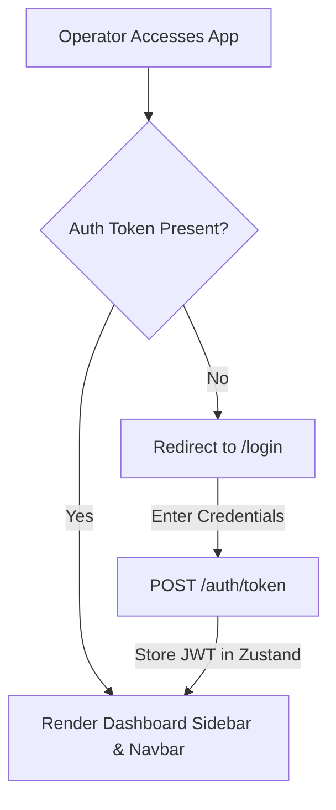

# F16: React Operator & Investigation Dashboard

## Purpose
The React operator frontend compiles campus CCTV ingestions, person trajectories, and student face databases into a unified, secure dashboard application.

---

## 1. Project Directory Layout

```
frontend/
├── src/
│   ├── components/
│   │   ├── Navbar.tsx             # Header displaying system status & operator info
│   │   ├── Sidebar.tsx            # Main layout dashboard navigation links
│   │   ├── SearchBar.tsx          # Reusable semantic search query input
│   │   ├── VideoPlayer.tsx        # Styled aspect-ratio HTML5 CCTV streamer
│   │   ├── Timeline.tsx           # Chronological point-by-point path tracker
│   │   ├── StudentCard.tsx        # Profile block grid lists
│   │   ├── DetectionCard.tsx      # Similarity-match visual crop blocks
│   │   └── ProcessingStatus.tsx   # YOLO/ByteTrack pipelines state progress bars
│   ├── pages/
│   │   ├── Login.tsx              # Secure OAuth2 credentials portal
│   │   ├── Dashboard.tsx          # Headquarter metrics cards
│   │   ├── Videos.tsx             # Ingestion logs database and viewer routes
│   │   ├── Upload.tsx             # Feeds upload drop zone
│   │   ├── Students.tsx           # Paginated roster with registration forms
│   │   ├── StudentDetails.tsx     # Photo angles and matching history list
│   │   ├── Search.tsx             # Semantic prompt similarity maps
│   │   ├── TimelinePage.tsx       # Trajectory tracking analysis workspace
│   │   └── Settings.tsx           # Configurable thresholds slider forms
│   ├── services/
│   │   └── api.ts                 # Axios instances + token header interceptors
│   ├── store/
│   │   └── useAuthStore.ts        # Zustand JWT local-storage session persistence
│   ├── App.tsx                    # React Router protected gates
│   ├── index.css                  # Custom scrollbars and Tailwind styles
│   └── main.tsx                   # React DOM root mounting
├── tailwind.config.js             # Styling themes
├── postcss.config.js              # PostCSS autoprefixing
└── vite.config.ts                 # Dev server setups
```

---

## 2. Protected Session Routing Flowchart



---

## 3. Standard UI Operations

### Ingestion & Uploads
- Files are parsed through multi-part form-data sent directly to `POST /videos`.
- Status indicators poll standard pipeline progress percentages.

### Face Enrollment Diagnostics
- Displays enrolled vs. missing views of target profiles.
- Triggers `POST /students/{id}/enroll` execution loops.

### Semantic Investigation
- Operates natural language matching directly against Qdrant database vectors via backend endpoints.
- Displays explanations tag overlays.
