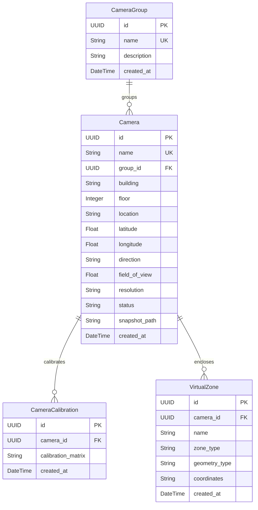

# F17: Camera Management & Virtual Zones

## Purpose
The **Camera Management & Virtual Zone Module** registers surveillance cameras, defines physical coordinates metadata (floor, direction, latitude/longitude), and supports drawing virtual polygons or tripwire boundaries for area intrusion monitoring.

---

## 1. Database Schema Mappings

---

## 2. Drawing Coordinates Format
Virtual boundaries are serialized as standard JSON strings storing pixel layout locations:
1. **Polygons**: Mapped as a coordinate sequence defining vertices boundaries, closed automatically on compile:
   * Format: `[[x1, y1], [x2, y2], [x3, y3], ...]`
2. **Lines (Tripwires)**: Mapped as 2 points defining line coordinates segment:
   * Format: `[[x1, y1], [x2, y2]]`

---

## 3. Exposed REST APIs

### Cameras CRUD
- `POST /api/v1/cameras/`: Create and initialize a new camera.
- `GET /api/v1/cameras/`: List registered cameras (filtering by building and status).
- `GET /api/v1/cameras/{id}`: Detailed record of a camera with nested zones and calibrations.
- `PUT /api/v1/cameras/{id}`: Edit camera metadata.
- `DELETE /api/v1/cameras/{id}`: Remove camera and nested dependencies.

### Virtual Zone Management
- `POST /api/v1/cameras/{id}/zones`: Save new drawn polygon or tripwire line to database.
- `DELETE /api/v1/cameras/{id}/zones/{zone_id}`: Remove virtual zone.
