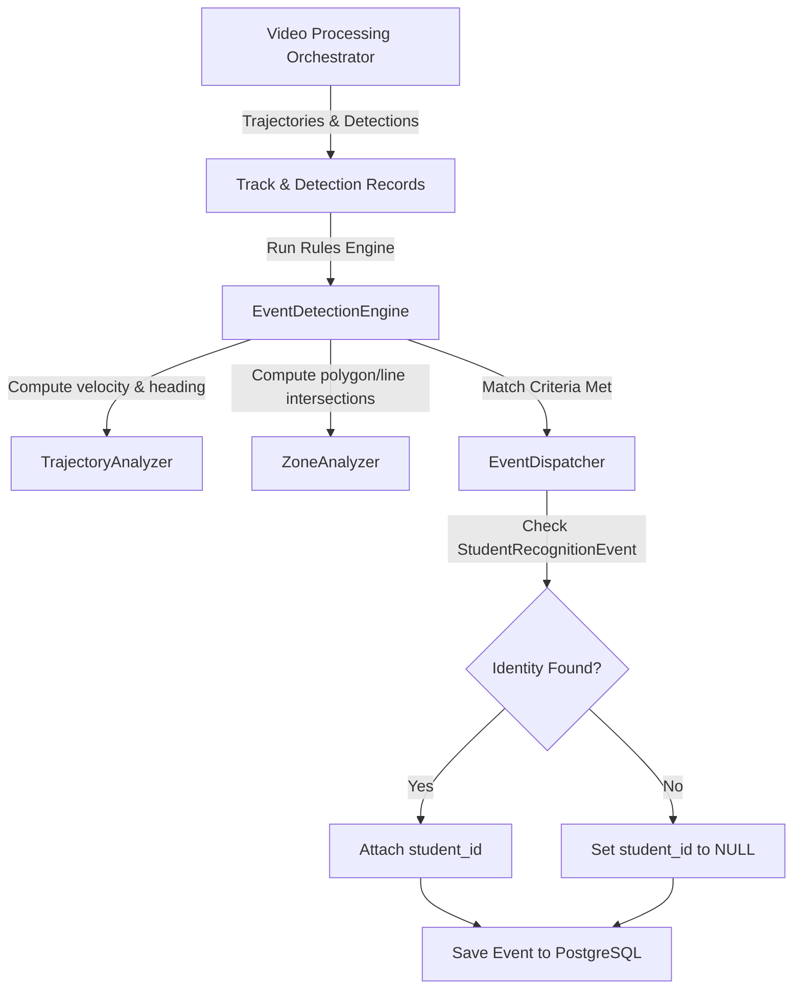

# F18: Event Detection Engine

## Purpose
The **Event Detection Engine** processes object tracks and trajectory coordinates against virtual zones, triggering custom alert rules (e.g. `FENCE_JUMP`).

---

## 1. Modular Event Analysis Architecture

---

## 2. PostgreSQL Schema layout
Stores generated alerts:
- `events`
  * `id` (UUID, PK)
  * `event_type` (String, e.g., `"FENCE_JUMP"`)
  * `camera_id` (UUID, FK to `cameras.id`)
  * `video_id` (UUID, FK to `videos.id`)
  * `timestamp` (DateTime, timezone=True)
  * `zone_id` (UUID, FK to `virtual_zones.id`)
  * `student_id` (UUID, FK to `students.id`, nullable=True)
  * `confidence` (String)

---

## 3. Exposed REST APIs
- `GET /api/v1/events/`: Lists all security alerts.
- `GET /api/v1/events/types`: Supported event classifications (`FENCE_JUMP`, etc.).
- `GET /api/v1/events/video/{video_id}`: Alert logs for a specific video feed.
- `GET /api/v1/events/{id}`: Detailed metadata with nested track linkages.
