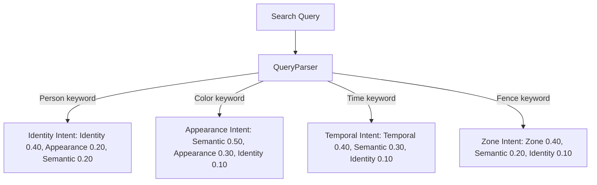

# F19: Explainable Adaptive Retrieval Engine

## Purpose
The **Explainable Adaptive Retrieval Engine** upgrades search rankings by introducing:
1. **Explainable Scoring Engine**: Breaks down query matches across 5 independent AI/Metadata similarity score channels.
2. **Adaptive Weighting**: Dynamically adjusts importance weights based on analyzed search intent.
3. **Structured Explanation Generation**: Provides readable matching bullet points explaining result matches.
4. **Evidence Ranking API**: Lists track-specific transgression matches ordered from highest confidence to lowest.

---

## 1. Score Channel Mappings & Intent Weights

| Score Channel | Key Metric | Source Component | Default Weight |
|---|---|---|---|
| **Semantic** | CLIP ViT-B/32 similarity | Qdrant | `0.40` |
| **Identity** | ArcFace face similarity | PostgreSQL Recognition Event | `0.20` |
| **Appearance** | OSNet track re-identification | PostgreSQL Re-ID embeddings | `0.20` |
| **Temporal** | Target time proximity | Search constraints evaluator | `0.10` |
| **Zone** | Boundary crossing alerts | PostgreSQL events | `0.05` |
| **Metadata** | Filter matches overlap | Search filters engine | `0.05` |

### Intent Weighted Adjustments

---

## 2. Structured Reason List Triggers
A bullet list is generated dynamically:
- **ArcFace Match**: `• Same student identity: {student_name} (ArcFace: {score})` (Trigger: score $\ge 0.60$).
- **OSNet Match**: `• Similar clothing & features (OSNet: {score})` (Trigger: score $\ge 0.50$).
- **Temporal Match**: `• Present in requested time range` (Trigger: score $\ge 0.80$).
- **Zone Match**: `• Crossed Fence Zone '{zone_name}'` (Trigger: score $\ge 0.50$).
- **CLIP Match**: `• High semantic similarity (CLIP: {score})` (Trigger: score $\ge 0.35$).

---

## 3. Exposed REST APIs
- `POST /api/v1/search/explain`: Search assets returning score vectors, reasons list, and match confidence.
- `GET /api/v1/search/evidence/{track_id}`: Fetch evidence crossing matches for a track, sorted from high to low confidence.
