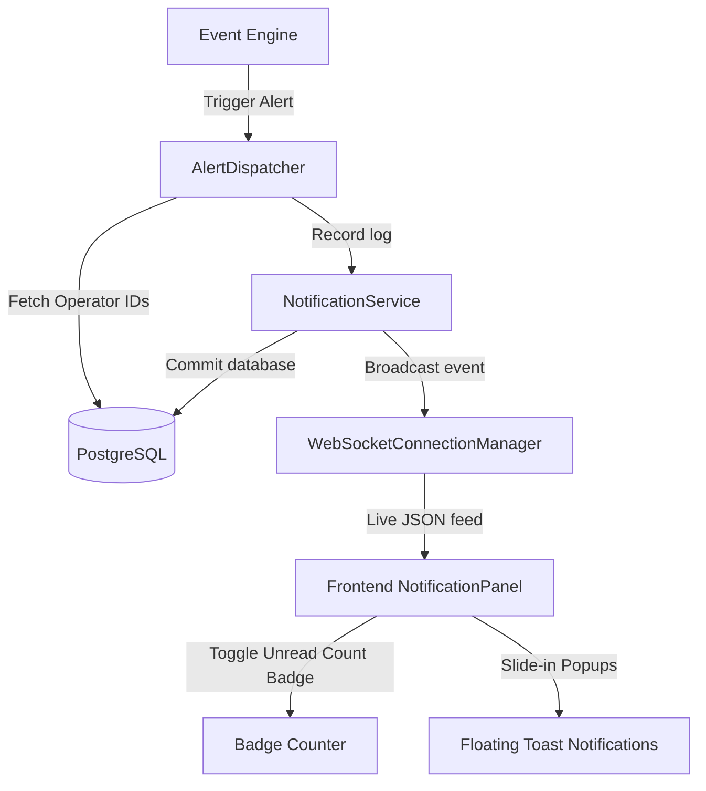

# F21: Real-Time Notification & Alert System

## Purpose
The **Real-Time Notification & Alert System** captures security transgression events (such as Fence Crossing) and broadcasts alert cards to logged-in security operators instantly.

---

## 1. Real-Time Alert Broadcast Architecture



---

## 2. PostgreSQL Schema
- `notifications`
  * `id` (UUID, PK)
  * `user_id` (UUID, FK to `users.id`)
  * `title` (String)
  * `message` (String)
  * `severity` (String - `"info"`, `"warning"`, `"critical"`)
  * `is_read` (Boolean)
  * `created_at` (DateTime, timezone=True)
- `notification_preferences`
  * `id` (UUID, PK)
  * `user_id` (UUID, FK to `users.id`, UK)
  * `email_notifications` (Boolean)
  * `push_notifications` (Boolean)
  * `min_severity` (String)

---

## 3. WebSocket Message Schema
Live broadcast payloads follow a standard format:
```json
{
  "type": "NOTIFICATION",
  "id": "c3b7a123-4567-89ab-cdef-0123456789ab",
  "title": "Fence Intrusion Alert",
  "message": "Subject jumped boundary fence at Cam-02-Fence-North.",
  "severity": "critical",
  "created_at": "2026-07-05T11:18:25Z",
  "is_read": false
}
```

---

## 4. Exposed REST & WS APIs
- `WS /api/v1/notifications/ws`: Live WebSocket pipeline stream.
- `GET /api/v1/notifications/`: Lists user's alerts history.
- `PUT /api/v1/notifications/{id}/read`: Mark a single alert card as read.
- `PUT /api/v1/notifications/read-all`: Mark all alerts read.
- `GET /api/v1/notifications/preferences`: Read alert channel settings.
- `PUT /api/v1/notifications/preferences`: Modify alert preferences (e.g. toggle email notifications).
