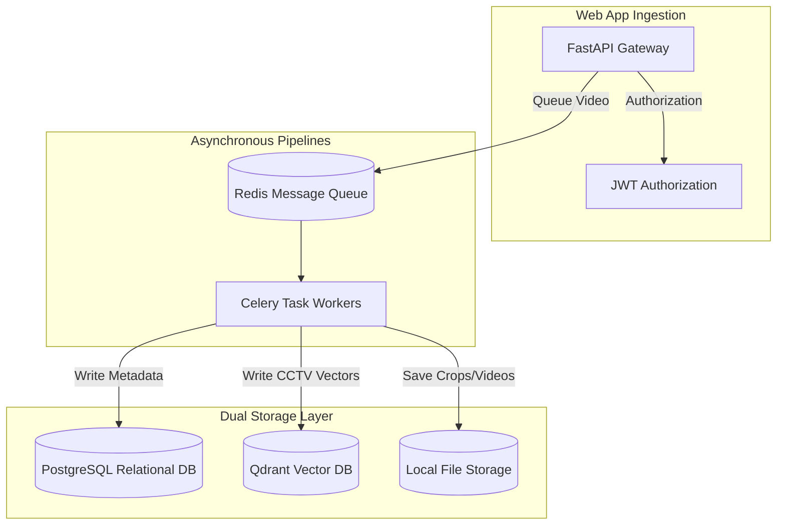

# Project Architecture

This document details the software architecture, database layers, processing pipelines, and integrations of the **AI-Powered Smart Campus Surveillance & Investigation System**.

---

## 1. High-Level System Architecture

---

## 2. Ingestion & Search Pipelines

### Video Processing Pipeline
1. **Video Ingestion**: Web dashboard uploads files using HTTP multipart uploads.
2. **Frame Downsampling**: Extract frames at 5 FPS to optimize compute.
3. **YOLOv8 Detection**: Detect objects (person, vehicle, bag).
4. **ByteTrack Association**: Correlate bounding boxes across frames to build trajectories.
5. **Crop Exporter**: Write tracking crop images to local disk.
6. **CLIP Embeddings**: Generate appearance descriptions.
7. **OSNet ReID**: Generate visual identity signatures for people.
8. **Indexing**: Save metadata to PostgreSQL and visual vectors to Qdrant.

### Student Face Enrollment Pipeline
1. **Student Registration**: Save student records in PostgreSQL.
2. **Photo Upload**: Save multi-angle student profile photos to `storage/students/{id}/{view}/`.
3. **Face Quality Gates**: InsightFace detects face, rejects blurred/small/multi-face crops.
4. **Embedding Generation**: ArcFace outputs 512-dim normalized vectors.
5. **Dual Indexing**: Save embeddings to PostgreSQL (`student_face_embeddings`) and Qdrant (`student_face_embeddings` collection).

---

## 3. Database Layer Configurations

### Relational Database (PostgreSQL)
- **Engine**: SQLAlchemy 2.0 (asyncio).
- **Key Tables**: `users`, `videos`, `tracks`, `detections`, `person_reids`, `students`, `student_photos`, `student_face_sessions`, `student_face_embeddings`, `bulk_import_jobs`.

### Vector Database (Qdrant)
- **Collection 1**: `cctv_embeddings` (size=512, Cosine distance). Stores CLIP appearance vectors.
- **Collection 2**: `student_face_embeddings` (size=512, Cosine distance). Stores ArcFace student face vectors.
